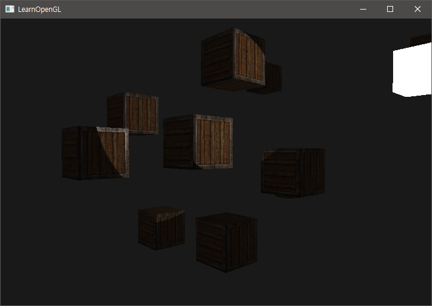
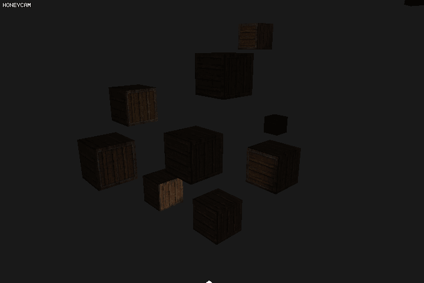

Chapter 10. Light casters

이때까지 써왔던 광원은 모두 한 점에서 발생된 빛이다. 이 빛에서 쉐이더를 구현해 조명 효과를 내는 것은 매우 좋지만 실제 세계에서는 이런 빛 종류 외에도 수 많은 조명의 종류가 있다. 한 점에서 발생된 빛은 레이저, 태양광을 예로 들 수 있지만, 손전등에서 나오는 빛과 같이 광원 자체가 퍼지거나 할 경우에는 이야기가 달라진다.

객체에 빛을 내리쬐는 광원을 **Light caster** 라고 한다. 이 튜토리얼에서는 light caster 의 몇 몇가지 종류를 살필 예정이다.

## Directional Light (직사광선)

태양광 같이, 광원이 매우 멀리 있을 때의 광선의 종류를 말한다. Directional Light 는 광원이 매우 멀리 있는 탓에 각각의 빛 줄기가 평행한 것처럼 보이게 된다. 따라서 World 좌표 위치에도 상관 없이 동일한 방향과 그로 인한 동일한 방향의 그림자를 가지게 된다.


따라서 실제 구현을 할 때, 광원과 오브젝트의 프래그먼트의 거리가 어느정도 되고 그로 인해서 세기가 어느정도 되야하는 지는 전혀 구현할 필요가 없어진다. 왜냐면 Directional Light 에서 내리쬐는 세기는 항상 다 같기 때문이다.

Directional Light 을 구현하기 위해서는 기존에 사용했던 `position` 벡터 대신에 `direction` 만으로 구현해야 한다. 이 때 direction 은 현재 쓰고 있는 파일의 경우엔 View space 로 전환을 해야 하기 때문에 View matrix 가 존재하는 Vertex Shader 에서 변수를 읽어 들어온다. 
밑의 파일은 Fragment Shader 의 Light.direction 의 쓰는 법을 적은 것이다.

``` c++
struct Light {
    // vec3 position; 
    // No longer necessery when using directional lights.
    vec3 direction;
  
    vec3 ambient;
    vec3 diffuse;
    vec3 specular;
};
...
void main() {
  vec3 lightDir = normalize(light.direction);
  ...
}
```

>지금 같은 경우는, 빛의 방향 등을 `vec3` 으로 넘겨줬지만, 간혹 `vec4` 로 넘기는 사람들도 볼 수 있다. 하지만 Fragment Shader 에서 `vec4` 로 넘겨줄 경우에 마지막 축인 `w` 값에 의해 변형이 될 수도 있기 때문에, Directional Light 을 쓸 경우에는 `w` 값을 0으로 넘겨줘야 한다.
>
>``` c++
>if(lightVector.w == 0.0) // note: be careful for floating point errors
>  // do directional light calculations
>else if(lightVector.w == 1.0)
>  // do light calculations using the light's position (like last tutorial)  
>```
>
>사실, `w` 값으로 Directional 인지 아니면 그외 광원인지 확인하는 과정은 초창기 OpenGL 에서 행해지던 방법이다.


## Point Lights

Directional Light 같이, 평행한 방향으로 모든 물체에 같은 세기의 빛을 비추는 광원도 있는가 하면, 우리가 일상 생활에서 보는 어느 한 점에서 빛이 사방으로 비추면서 거리에 따라 *감쇠* 가 되는 광원들이 있다. 작은 꼬마 전구가 물체들을 비춘다고 할 때, 각 물체의 거리에 따라서 물체에 입사되는 빛의 각도가 다를 뿐더러, 빛의 세기 역시 다를 수 있다.


### 감쇠 (Attenuation)

Point Light 의 거리에 따른 빛의 세기의 감쇠는 가장 일반적으로 선형 방정식으로 쓸 수도 있고 아니면 일반 반비례 상수에 의해 거리가 늘어날 수록 세기가 반비례 하게 할 수도 있다. 하지만 이런 방식은 약간 현실 세계에 적용되는 감쇠와는 많이 다르다. 따라서 다음과 같은 식을 적용해 Point Light 의 거리에 따른 세기를 얻을 수 있다.
$$
\mathbf{F}_{att} = \frac{1.0}{\mathbf{K}_c + \mathbf{K}_l * \mathbf{d} + \mathbf{K}_q * \mathbf{d^2}}
$$

* $$ \mathbf{d} $$ 는 빛의 광원과 프래그먼트 사이의 거리를 말한다.
* $$ \mathbf{K}_c $$ 는 **Constant Term** 이며, 분모가 분자보다 작지 않기 위해 거의 항상 $ 1.0 $ 을 유지한다.  만약 분모가 1.0 보다 작으면, $$ \mathbf{F}_{att} $$ 는 1.0 보다 반비례로 커지며 원치 않은 결과를 얻게 된다.
* $$ \mathbf{K}_l $$ 은 **Linear Term** 이며, $$ \mathbf{d} $$ 에 곱해지는 계수 상수이다.
* $$ \mathbf{K}_q $$ 는 **Quadratic Term** 이며, $$ \mathbf{d^2} $$ 에 곱해지는 계수 상수이다. 이 계수는 사이 거리가 작을 때는 Linear Term 에 의해 분모의 값에 차지하는 비중이 낮다. 하지만 거리가 커질 수록 분모의 값의 부분을 차지하게 된다. 사이 거리가 크면 이 계수에 의해 빛의 영향이 완전히 없어지게 된다.


#### 계수 값 선택하기

그러면 3개의 K 값을 어떻게 구해야 할까? K 값을 구할 때 조명 고유의 값이나 환경 등에 의해 좌우된다. 사실 대부분의 경우에는 이 값들을 이리저리 움직여 보면서 실험을 해보는 것이다. 하지만 밑에 간단하게 쓸 수 있는 표가 주어져 있기 때문에 이것을 기반삼아 값을 조절해보는 것이 좋다.

| Distance | Constant |  Linear  | Quadratic  |
| :------: | :------: | :------: | :--------: |
|   `7`    |  `1.0`   |  `0.7`   |   `1.8`    |
|   `13`   |  `1.0`   |  `0.35`  |   `0.44`   |
|   `20`   |  `1.0`   |  `0.22`  |   `0.20`   |
|   `32`   |  `1.0`   |  `0.14`  |   `0.07`   |
|   `50`   |  `1.0`   |  `0.09`  |  `0.032`   |
|   `65`   |  `1.0`   |  `0.07`  |  `0.017`   |
|  `100`   |  `1.0`   | `0.045`  |  `0.0075`  |
|  `160`   |  `1.0`   | `0.027`  |  `0.0028`  |
|  `200`   |  `1.0`   | `0.022`  |  `0.0019`  |
|  `325`   |  `1.0`   | `0.014`  |  `0.0007`  |
|  `600`   |  `1.0`   | `0.007`  |  `0.0002`  |
|  `3250`  |  `1.0`   | `0.0014` | `0.000007` |

#### 감쇠 구현

Fragment Shader 프로그램에 다음과 같이 $$ \mathbf{K} $$ 상수 계수의 변수를 넣는다.

``` c++
#version 330 core

// Light properties && struct can't let it out or put them in.
struct uLight {
	vec3 ambient;			// light Colors
	vec3 diffuse;
	vec3 specular;

	float constant;
	float linear;
	float quadratic;
};
```

그리고 거리에 따른 감쇠 효과를 적용하기 위해 다음과 같이 `_ATT` 을 구한다.

``` c++
// ...
void main() {
	vec3 lightVec	= LightPos - FragmentPos;
	float _D = sqrt(dot(lightVec, lightVec));
	float _ATT = 1.0f / (Light.constant + (Light.linear * _D) + (Light.quadratic * pow(_D, 2)));
  
// ...
```

마지막으로 `ambient`, `diffuse` 및 `specular` 에 감쇠를 반영한다.

``` c++
ambient  *= attenuation; 
diffuse  *= attenuation;
specular *= attenuation;
```

> 여기서 왜 `ambient` 에 마저 감쇠를 적용하는가 궁금할 것 같은데, World 공간에 단일 광원만 있는 경우에는 아무 효과가 없지만 만약에 여러 광원이 동시에 존재하면 환경 조명조차 광원에 의해 빛 값이 쌓여나가기 때문에 감쇠를 해줘야 한다.

### Spotlight

Spotlight 는 Point light 와 비슷하지만, **특정 한 방향**으로 빛을 점사한다는 점에서 다르다. 

Spotlight 는 World 공간의 좌표로 표현될 수 있다. 하나는 **방향**(Spotlight direction) 이며 또 하나는 **Cutoff Angle** 이다. Cutoff angle 은 조명이 비출 반경을 정의하는 값이다.


* `LightDir` : 임의 프래그먼트의 위치에서 광원까지의 방향
* `SpotDir` : 광원에서 프래그먼트로 향하는 빛의 주방향
* Phi $$ \Phi $$ : Cutoff angle. 이 각도에서 벗어난 프래그먼트들은 빛의 영향을 받지 않는다.
* Theta $$ \theta $$ : `LightDir` 과 `SpotDir` 벡터 사이의 각도. 빛의 영향을 받기 위해서는 $$ \theta $$ 가 $$ \Phi $$ 보다 작거나 같아야 한다.

#### Flashlight

그러면 이것을 어떻게 구현해야 할까? 이전과 같이 내적을 이용해 $$ \cos{\theta} $$ 의 값이 $$ \cos{\phi} $$ 보다 크면 빛을 받도록 하면 될 것이다. 다만 이렇게 하는 방법은 0 도에서 180 도까지 밖에 적용이 되지 않는다. ( 그 이상의 각도를 cutoff 로 하고 싶다면 역조명으로 구현하면 된다 )

다음은 Fragment Shader 의 코드 부분이다.

``` c++
// Light properties && struct can't let it out or put them in.
struct uLight {
	vec3 direction;
	float cutoff;

	vec3 ambient;			// light Colors
	vec3 diffuse;
	vec3 specular;

	float constant;
	float linear;
	float quadratic;
};

// ...

// CutOff
vec3 lightDir	= normalize(lightVec);
float theta		= dot(-lightDir, normalize(Light.direction));

vec3 diffuse	= vec3(0.0);
vec3 specular	= vec3(0.0);

// If theta between fragment position and light source is bigger than Light.cutoff,
// then calculate diffuse and specular;

if (theta > Light.cutoff) {
	// Diffuse & Specular
}

// Ambient
```

이 때 주의해야 할 점은, `direction` 은 방향만 가진 벡터이기 때문에 위치의 정보를 가져서는 안된다. 또한, World 공간 상의 `direction` 벡터를 View space 의 좌표로 변환할 때, w 값은 $$ 0.0 $$ 이어야 한다. 왜냐면 $$ 0.0 $$ 이 아닌 w 값이 있게 되면 카메라의 위치에 따라 방향값이 변환되기 때문이다.

결과는 다음과 같다.



감쇠를 적용했기에 조명의 범위에 있으나 멀리 있는 물체가 가까이에 있는 물체보다 `diffuse` 및 `specular` 의 값이 작게 보인다. 하지만 또 다른 문제는 조명의 가장자리가 비현실적이라는 것이다. 따라서 가장자리를 부드럽게 해서 보다 현실적으로 구현하고자 한다.

#### Smooth / Soft Edges

부드러운 가장자리를 가진 Spotlight 을 구현하기 위해서는 Spotlight 가 *inner* 원뿔과 *outer* 원뿔 (cone) 을 가져야 한다. 이전까지 우리가 구현한 Spotlight 는 *inner* 이 된 셈이다. *outer* cone 은 `lightDir` 에서 거리가 멀어질 수록, 밝기가 점차 감소하는 추세를 보여야 한다.

*outer cone* 을 구현하는 것은 *inner cone* 을 구현할 때와 같다. 한계 각도 ($$ \phi $$) 을 입력한 다음, Fragment Shader 안에서 연산을 시켜 inner 와 outer 의 사이라면, 사이 값으로 컬러 계산을 하게 한다. 다만 이 계산식이 별도로 주어져 있다.
$$
\mathbf{I} = \frac{\theta - \gamma}{\epsilon}
$$

* $$ \mathbf{I} $$ = $$ 0.0 $$ 에서 $$ 1.0 $$ 사이의 값을 가지는 **강도** 값.
* $$ \theta $$ = `LightDir` 과 `SpotDir` 사이의 각도의 $$ cos $$ 값.
* $ \gamma $ = *outer cone* 의 경계 각도의 $$ cos $$ 값.
* $ \epsilon $ = *inner cone* 과 *outer cone* 의 경계 각도의 $$ cos $$ 값의 차이.

이 식을 통해, 인위적으로 명암 보간을 할 수 있다.

``` c++
#version 330 core

// Light properties && struct can't let it out or put them in.
struct uLight {
	vec3 direction;
	float inCutoff;
	float outCutoff;

	vec3 ambient;			// light Colors
	vec3 diffuse;
	vec3 specular;

	float constant;
	float linear;
	float quadratic;
};

// ...


if (theta > Light.outCutoff) {
 	// ...
	// Interpolation
	float epsilon	= Light.inCutoff - Light.outCutoff;
	float smoothy	= clamp((theta - Light.outCutoff) / epsilon, 
                            0.0, 1.0);
  
	diffuse			*= smoothy;
	specular		*= smoothy;
}
```

결과는 다음과 같다.



## Multiple Lights

