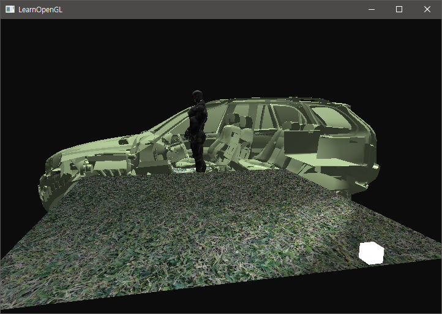
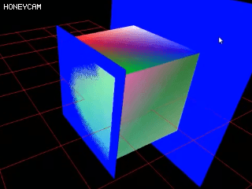

# Chapter 12. Depth testing

지난 Coordinate system 에서는 *Face rendering* 도중에 뒷면이 앞면의 앞으로 오는 것을 막기 위해 *Depth buffer* 을 이용한 3D 컨테이너를 만든 적이 있었다. 이 튜토리얼에서는 Depth buffer (z-buffer) 가 저장하고 있는 **Depth value** 을 좀 더 깊게 파고 들어가서, 만약 프래그먼트가 다른 프래그먼트의 뒤쪽에 있다면 어떻게 값이 결정되는지를 알아보고자 한다.

* *Depth buffer* 은, 컬러를 저장하는 *Color buffer* 와 비슷하게, **프래그먼트 당 정보**를 저장한다. 이 깊이 버퍼의 크기는 컬러 버퍼와 거의 같은 width 와 height 을 가진다. 이 깊이 버퍼는 시스템에 의해 자동으로 생성되며, `16`, `24`, `32` 비트의 부동 소수점 형을 가진다. 대개 `24` 비트의 부동 소수점을 가진다.
* **Depth testing** 은 OpenGL 의 함수 `glEnable` 와 같은 것으로 활성화가 가능하다. 이 testing 은, 깊이 버퍼의 내용물에 대해서 깊이 값을 비교하는 방식으로 테스트를 한다. 이 테스트를 통과하게 되면 Depth buffer 는 새로운 값으로 업데이트 된다.
  만약 Depth test 가 실패하면, 프래그먼트는 최종적으로 안보이게 된다.
* 이런 Depth testing 은 프래그먼트 쉐이더 처리와, 스텐실 테스팅 (Stencil testing) 이 끝난 뒤의 **Screen space** 에서 진행된다. 스크린 공간의 좌표는 완전 직접적으로 OpenGL 의 viewport 사이즈와 연결되어 있으며, 스크린 공간의 좌표는 built-in `gl_FragCoord` 변수로 `x` 와 `y` 의 접근이 가능하다.
* `gl_FragCoord` 의 `x` 와 `y` 요소는 각 프래그먼트의 스크린 공간의 좌표를 알려준다. 그런데 이 변수 안에는 z 요소도 포함되어 있어 이 z 요소가 실제 프래그먼트의 depth value 가 되어 Depth buffer 의 내용들과 비교한다.

> 요즘의 차세대 GPU 들은 **early depth testing** 이라고 하는, 프래그먼트 쉐이더 이후에 깊이 테스트를 하지 않고 프래그먼트 쉐이더 이전 단계에서 Depth buffer 와 Depth value 을 비교해 어느 프래그먼트를 처리하지 않을지 결정하는 단계를 미리 거친다.
>
> 왜냐면 모든 프래그먼트에 대해서 Fragment shader 을 거치게 하는 것은 매우 비효율적이기 때문이다. 하지만 이 early depth testing 을 하는데는 약간의 제약 조건이 따른다.
>
> * Fragment shader 가 fragment 의 depth value 을 쓰지 말도록 해야한다.
>
> 만약 Fragment shader 가 Fragment 의 depth value 을 고쳐쓰거나 한다면, early depth testing 은 쉐이더 이전의 단계에서 진행되기 때문에 이 단계에서 후 단계의 depth 의 값을 알 방법은 전혀 없어진다. 따라서 early depth testing 은 불가능해진다.

Depth testing 은 OpenGL 에서는 기본적으로 해제가 되어 있기 때문에, `glEnable` 와 인자로 `GL_DEPTH_TEST` 로 활성화를 시켜줘야 한다.

``` c++
glEnable(GL_DEPTH_TEST);
```

그리고 OpenGL 은 각 프래그먼트가 깊이 테스팅을 통과하면 자동으로 깊이 버퍼의 z-value 을 저장하고, 다른 프레임에서 해당 프래그먼트의 깊이 테스트가 통과하지 못하면 프래그먼트를 버리는 방식을 택하고 있다. 따라서 매 프레임마다 깊이 버퍼의 값들을 지우지 않으면 마지막 프레임에서 렌더링된 프래그먼트의 `z` 값들에 의해서 렌더링이 이상하게 되거나 프리즈가 일어날 수 있다.

``` C++
glClear(GL_COLOR_BUFFER_BIT | GL_DEPTH_BUFFER_BIT);
```

만일에, 프로그래머가 Fragment shader 을 통과한 모든 프래그먼트에 대해서 depth testing 을 하고 싶지만 깊이 버퍼에 쓰고 싶지는 않을 때는 `glDepthMask` 함수를 이용해서 마스킹을 활성화시키거나 비활성화 시킬 수 있다.

``` g++
glDepthMask(GL_FALSE);
```

이 기능을 활성화 하면, Depth buffer는 오직 *Read-only* 로만 읽어올 수 있다.

## Depth test function

OpenGL 은 Depth testing 을 할 때 사용되는 비교 연산자를 바꿀 수 있도록 해준다. 비교 연산자는 다음 `glDepthFunc` 함수를 통해서 비교 연산자를 바꿀 수 있다.

``` c++
glDepthFunc(GL_LESS);
```

이 함수는 아래 테이블에 정리된 몇 가지 비교 연산자를 받아서 테스트 조건을 바꿀 수 있다.

| Function      | Description                              |
| ------------- | ---------------------------------------- |
| `GL_ALWAYS`   | The depth test always passes.            |
| `GL_NEVER`    | The depth test never passes.             |
| `GL_LESS`     | Passes if the fragment's depth value is less than the stored depth value. |
| `GL_EQUAL`    | Passes if the fragment's depth value is equal to the stored depth value. |
| `GL_LEQUAL`   | Passes if the fragment's depth value is less than or equal to the stored depth value. |
| `GL_GREATER`  | Passes if the fragment's depth value is greater than the stored depth value. |
| `GL_NOTEQUAL` | Passes if the fragment's depth value is not equal to the stored depth value. |
| `GL_GEQUAL`   | Passes if the fragment's depth value is greater than or equal to the stored depth value. |

OpenGL 은 기본으로 `GL_LESS` 연산자를 쓴다. 만약 `GL_ALWAYS` 을 세팅하면 다음과 같이 모든 프래그먼트가 화면에 출력될 것이다. (depth testing 을 비활성화 한 상태와 같다)



## Depth value precision

Depth value 는 $$ 0.0 $$ 에서 $$ 1.0 $$ 까지의 `float ` 값을 갖고 있다. 이 값들은 view 가 카메라를 통해 보는 장면에 있는 모든 오브젝트들의 `z-value` 와 비교하면서 테스트를 하게 된다. 화면의 오브젝트들의 `z-value` 는 Clip scene 에서의 특유의 각뿔의 `near` 와 `far` 값 사이의 값이 될 수 있다.

따라서 OpenGL 은 View 공간에서의 각 프래그먼트의 `z-value` 을 $ 0 $ 에서 $ 1 $ 까지의 사이 값으로 변환해야 한다. 이 때 쓰이는 방법 중 하나가 선형으로 변환하는 것이 있다. 다음의 선형 방정식은 View space 에서의 마구잡이의 `z` 값을 (그래도 카메라에 가까울 수록 0 이 되는 건확실하지만) 에서 $ 1.0 $ 사이의 Depth value 로 변환한다.
$$
\mathbf{F}_{depth} = \frac{z - near}{{far} - {near}}
$$
여기서 쓰이는 $ near $ 와 $ far$ 값은, 이전에 Projection matrix 을 쓸 때 설정해줬던 `near` 과 `far` 값이 된다. 만약에 `z` 값이 near 과 같다면 0 이 될 것이며, far 과 같다면 1 이 될 것이다.


하지만, *linear depth buffer* 는 **거의 쓰이지 않는다**. 그러면 대체 뭘 써야할까?

기존 선형 방정식에서 크게 변한건 없으나, `z` 나 `near` 및 `far` 값들을 모두 역분수로 변환한 방정식을 쓰게 한다.
$$
\mathbf{F}_{depth} = \frac{\frac{1}{z} - \frac{1}{near}}{\frac{1}{far} - \frac{1}{near}}
$$
이 방정식은 `z` 가 작을 때는 정확도가 크지만, `z`가 far 에 가까워 질수록 정확도가 줄어드는 것을 알 수 있다. 근데 왜 이런 방정식을 쓸까? 라고 생각한다면 우리 일상 생활에서 빗댈 수 있다.

우리가 먼 거리를 볼 때, 먼곳에 있는 물체 1000개에 대해서 '어떤 것은 거리가 991에 있고 어떤 것은 992에 있고 다른 것은 984에 있다' 라고 말하지는 않는다. 대충 '얘네들은 한 950 즈음에 있을려나...?' 하는 것이 일반적인 반응이다. 그 외에도 컴퓨터적인 시각에서 보자면은 near 와 far 사이의 거리가 1000 일 때, 아주 멀리 멀리 있는 몇천개의 오브젝트에 대해서도 `z` 값이 1 전후의 프래그먼트를 테스팅할 때처럼 하는 것은 별로 안 좋을 것이다.


위에서도 알 수 볼 수 있듯이, depth value 는 `z` 값이 작을 때는 매우 큰 depth value 의 정확도를 유지하는 것을 알 수 있다. 이 해괴한 방정식은 **Projection matrix** 안에 포함되어 있으며 clip space 와 screen space 로 변환할 때 이 방정식이 쓰이게 된다.

여기서 짧게나마 어떻게 이 방정식과 매트릭스가 돌아가는지 한번 보도록 하자...

### OpenGL Projection Matrix

컴퓨터 모니터는 2D 화면이다. OpenGL 에서 구현하는 공간은 3D 이기 때문에 어찌됬건간에 최종에는 3D 화면을 2D 로 구현해야 한다. 이 때 변형에 쓰이는 매트릭스가 `GL_PROJECTION` , 투영 매트릭스이다.

이 때 Projection matrix 에는 **Frustum culling** 과 **NDC transformation** 이 통합되어 들어가 있다. 그리고 frustum culling 은 Clip 공간의 좌표들을 $$ \mathbf{w}_c $$ 값으로 나누기 전에 수행된다는 것을 알아뒀으면 한다. (나중에 덧붙여 쓰기)

## Visualizing the depth buffer

GLSL 의 built-in 변수인 `gl_FragCoord` 의 `z` 값이 depth value 인 것을 알기 때문에 이 값을 가지고 화면 상에서 어떻게 나타내는 지를 알 수 있다. 프래그먼트 쉐이더에 다음과 같이 쓴 다음에 실행을 하고 돌아다니면 다음과 같이 회색조의 모델들을 볼 수 있다.

``` c++
void main() {             
    FragColor = vec4(vec3(gl_FragCoord.z), 1.0);
}  
```


여기서 거리가 가까워 질 수록 `z` 값이 $ 0 $ 에 근접해지기 때문에 어두워지는 것을 볼 수 있고, 멀어지면 비선형적으로 `z` 값이 높아져 밝아지는 것을 볼 수 있다. 따라서 일정 거리 뒤에서는 보이는 모든 것이 하얀색에 가까워지는 것을 알 수 있다. (이 때 조명은 z 값에 영향을 주지 않는다.)

## Z-fighting

비선형적인 Depth value 방정식때문에 일어나는 고질적인 문제가 **Z-fighting** 이다. 이 현상은 아주 멀리 있는 물체들이 매우 가깝게 붙어있는 바람에 일어나는 문제이다. 전혀 다른 물체들의 Fragment 가 매우 가깝게 붙어있으면 Depth value 의 값이 매우 근사하거나 같게 생성되면서 매 프레임마다 혹은 몇 프레임마다 다른 프래그먼트가 서로 보이게 되는 현상을 일으킨다.

한 마디로 말하면, 누가 먼저 위에 있을 것인지 매 프레임마다 싸우기 때문에 Z-fighting 이라고 이름이 붙여졌다. 



z-fighting 문제는 완전히 방지할 수는 없지만 이 문제를 막기 위한 몇 몇가지 트릭이 존재하긴 한다.

### Prevent z-fighting

* 가장 간단한 방법은, 물체를 너무 가깝게 두지 않게 해서 프래그먼트가 서로 겹치지 않게 하는 것이다. 두 오브젝트 사이에 매우 작은 격차를 두게 하면 플레이어가 모를 뿐만 아니라 거의 z-fighting 현상을 줄여준다.
* 두번째 트릭은 물체를 가깝게 두는 것이다. 하지만 이 방법은 FPS 와 같이 플레이어의 카메라가 역동적으로 돌아다녀야 하는 것에서는 그렇게 효과가 크지 않을 것 같다.
* 또 다른 트릭은 매우 높은 정확도를 가진 `32` 비트 이상의 Depth buffer 을 쓰는 것이다. 하지만 이 방법의 경우에는 성능이 요구되는 단점이 있을 수 있다.

