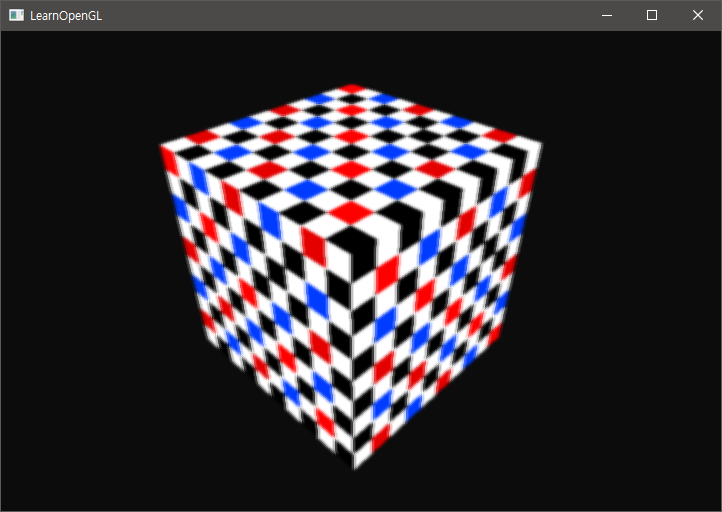

# Chapter 16. Framebuffers

여태까지의 튜토리얼에서는 Color Buffer 와 Depth Buffer 그리고 Stencil Buffer 을 살펴봤다. 이 세가지 버퍼를 다 합친 것이 **Framebuffer** 이고, 이 버퍼는 여타 다른 버퍼와 마찬가지로 VRAM 의 어딘가에 저장되어 있다. OpenGL 은 사용자에게 사용자만의 프레임 버퍼를 정의해서 후처리를 할 수 있도록 도와준다.

사실, glfw 가 맘대로 처리를 해버려서 우리는 잘 모르고 있었지만 GLFW 는 윈도우를 생성할 때 기본 프레임버퍼 (default framebuffer) 을 생성해서 그 위에 깊이 버퍼, 컬러 버퍼, 스텐실 버퍼 등을 만들어서 쓸 수 있도록 해준다.

커스터마이징 된 프레임버퍼를 사용하면, 거울을 만들 수 있다거나, 후처리 이펙트(post-processing effects) 을 사용할 수 있도록 도와줄 수 있다. 우선 이 프레임워크가 어떻게 처리되는지를 한번 보고 후처리 이펙트를 실장해본다.

## Creating a framebuffer

OpenGL 의 여타 다른 오브젝트들과 마찬가지로 framebuffer object (FBO) 을 만들어야 한다. 다만 VAO, VBO, EBO 등이 `glGenBuffers` 을 이용해서 버퍼를 생성한 반면에 Framebuffer 는 `glGenFramebuffers` 을 통해서 만들어야 한다. 그리고 `glBindFramebuffer` 을 써서 버퍼를 바인딩 시켜줘야 한다. 이렇게 되면 기본 프레임버퍼를 바인딩 해제시키고 우리가 만든 프레임버퍼가 바인딩된다.

``` c++
GLuint fbo;
glGenFramebuffer(1, &fbo);
glBindFramebuffer(GL_FRAMEBUFFER, fbo);
```

프레임버퍼를 `GL_FRAMEBUFFER` 로 바인딩하게 되면 모든 *읽기* 와 *쓰기* 프레임버퍼 작업이 현재 바인딩 된 프레임버퍼의 권한으로 들어가게 된다. 현재 바인드 된 프레임버퍼에 읽기 작업만 할당하고 싶다면, *GL_READ_FRAMEBUFFER* 을 쓰면 되고, *쓰기* 작업만 할당하게 하고 싶으면 *GL_DRAW_FRAMEBUFFER* 을 쓰면 된다.

`GL_READ_FRAMEBUFFER` 키워드는 `glReadPixels` 와 같은, 현재 바인드된 프레임버퍼에서 묘화된 픽셀들의 정보들을 읽어와 data 에 집어넣는 것과 같은 함수에 쓰일 수 있다. `GL_DRAW_FRAMEBUFFER` 키워드는 렌더링, 버퍼 초기화 등의 쓰기 작업에 쓰일 수 있다.

이제 **몇 가지 작업**을 더 해줘야 프레임 버퍼가 온전히 작동할 수 있다. 프레임버퍼가 완성될려면 다음 작업들이 필요하다.

* Color, Depth, Stencil 버퍼 중 적어도 하나가 프레임 버퍼에서 생성되어 있어야 한다.
* 적어도 하나 이상의 Color attachment 가 있어야 한다.
* 이런 Attachment 들은 메모리 확보가 되어 있어야 한다.
* 각 버퍼는 모두 동일한 샘플 수를 가지고 있어야 한다.

이 요구사항을 다 만족시키고 나서는 프레임버퍼가 제대로 생성되었는 지를 확인하기 위해 `glCheckFramebufferStatus` 에 `GL_FRAMEBUFFER`을 넣어 상태를 불러올 수 있다. 상태 정보는 다음 크로노스 재단의 [API 문서](https://www.khronos.org/registry/OpenGL-Refpages/gl4/html/%67lCheckFramebufferStatus.xhtml)에서 볼 수 있다.

``` c++
if (glCheckFramebufferStatus(GL_FRAMEBUFFER) == GL_FRAMEBUFFER_COMPLETE)
  	// execute victory dance
```

커스텀 프레임버퍼가 바인딩이 되었고, 프레임버퍼가 온전하게 생성된 것을 확인했으면 그 뒤로 묘화되는 모든 렌더링 작업들은 이 프레임버퍼 안에서 진행된다. 하지만 지금 우리가 만든 프레임 버퍼가 기본 프레임버퍼는 아니기 때문에, 이 프레임버퍼 안에서 진행되는 모든 렌더링 작업들은 Window 상에서 보이지 않는다.

이 이유는, 기본 프레임버퍼는 On-screen 에 있고, 현재 바인딩 된 프레임버퍼는 Off-screen 에 있기 때문에 **Off-screen rendering** 이 일어나게 된다. 따라서 모든 렌더링 작업이 메인 윈도우 (기본 프레임버퍼) 에서 진행될 수 있도록 다시 기본 프레임버퍼로 바인드를 해준다.

``` c++
glBindFramebuffer(GL_FRAMEBUFFER, 0);
```

만약 렌더링을 다 마치고, 프레임버퍼를 지워야 할 경우에는 다음과 같이 쓸 수 있다.

``` c++
glDeleteFramebuffers(1, &fbo);
```

* **Attachment**
  프레임버퍼 안에서 여타 다른 버퍼처럼 행동할 수 있는 공간의 메모리 위치. (포인터)
  Attachment 가 적어도 하나는 있어야 하는데, 이 Attachment 로 **Texture** 혹은 **renderbuffer** 오브젝트를 선택할 수 있다.

### Texture Attachments

사용자 프레임버퍼에 Texture 을 Attachment 로 붙이게 되면, Texture 는 기존 프레임버퍼의 Color/Depth/Stencil 버퍼처럼 **값들을 텍스쳐에 쓰게** 된다. 텍스쳐를 부착물로 사용하는 방법의 장점은, 사용자 프레임버퍼에서 렌더링된 모든 결과물들이 텍스쳐에 저장되기 때문에 이 텍스쳐를 다시 쉐이더 프로그램을 이용해 쓸 수 있다.

프레임버퍼의 텍스쳐를 만드는 과정은 일반 노멀 텍스쳐를 만들 때와 거의 같다.

``` c++
unsigned int texture;
glGenTextures(1, &texture);
glBindTexture(GL_TEXTURE_2D, texture);
  
glTexImage2D(GL_TEXTURE_2D, 0, GL_RGB, 800, 600, 0, GL_RGB, GL_UNSIGNED_BYTE, NULL);

glTexParameteri(GL_TEXTURE_2D, GL_TEXTURE_MIN_FILTER, GL_LINEAR);
glTexParameteri(GL_TEXTURE_2D, GL_TEXTURE_MAG_FILTER, GL_LINEAR); 
```

하지만 여기서 주의해야 할 점은, width 와 height 인자가 *화면 사이즈와 같다는 점* 과 (다를수도 있지만 주의가 필요하다) 두번째로 data 을 지정하는 *인자가 NULL *이라는 점이다. 따라서 이 텍스쳐는 앞으로 나중에 렌더링 과정에서 값들이 쓰일 예정이기 때문에 메모리 공간 할당만 하고 값들을 채우지는 않는다는 셈이 된다.

**텍스쳐에 값을 쓰는 것은 프레임버퍼에서 렌더링을 할 때 이루어진다.**

> 만약에 전체 스크린을 좀 더 작은 텍스쳐 사이즈 혹은 큰 텍스쳐 사이즈에 쓰고 싶다면, 스크린에 반영되는 영역을 조절하기 위해서 `glViewport` 을 사용해야 한다. 그렇지 않으면 전체 스크린의 일부만이 텍스쳐에 쓰일 것이다.

이제 texture (for attachment) 을 만들었으니 이 텍스쳐를 사용자 프레임버퍼에 붙이는 일만 남았다.

``` c++
glFramebufferTexture2D(GL_FRAMEBUFFER, GL_COLOR_ATTACHMENT0, GL_TEXTURE_2D, texture, 0); 
```

`glFrameBufferTexture2D` 는 다음 인자들을 가진다.

* target : 텍스쳐를 부착물로 쓸 프레임 버퍼의 모드
* attachment : 텍스쳐를 쓸 용도 (attachment 의 타입). 여기서는 `GL_COLOR_ATTACHMENT0` 으로 Color buffer 로 쓴다는 의미를 가질 것이다.
* textarget : Attachment 로 쓸 텍스쳐의 타입
* texture : 텍스쳐의 ID
* level : 밉맵의 정도.

위 함수의 인자를 보아 Color attachment 말고도 Depth attachment 혹은 Stencil attachment 을 쓸 수 있다는 것을 알 수 있다. (`GL_DEPTH_ATTACHMENT`, `GL_STENCIL_ATTACHMENT`, `GL_DEPTH_STENCIL_ATTACHMENT`)

> 하지만 Depth buffer 의 역할을 해낼려면 Texture 의 포맷과 내부 포맷이 `GL_DEPTH_COMPONENT` 가 되야한다. Stencil buffer 역시 포맷이 `GL_STENCIL_INDEX` 가 되야한다.

텍스쳐의 각 공간은 32비트로 이루어져 있는데, `DEPTH_STENCIL_`을 사용하게 되면 24 비트는 Depth 값으로, 나머지 8비트는 Stencil 값으로 사용된다. 다음은 `DEPTH_STENCIL_` 로 텍스쳐를 붙이는 코드다.

``` c++
glTexImage2D(
  GL_TEXTURE_2D, 0, GL_DEPTH24_STENCIL8, 800, 600, 0, 
  GL_DEPTH_STENCIL, GL_UNSIGNED_INT_24_8, NULL
);

glFramebufferTexture2D(GL_FRAMEBUFFER, GL_DEPTH_STENCIL_ATTACHMENT, GL_TEXTURE_2D, texture, 0); 
```

### Renderbuffer object attachments

기존 Texture 을 이용해서 프레임버퍼의 Attachment 을 구현한 방법이 옛날 방법이라고 하면, *Render buffer* 을 이용해 프레임버퍼의 Attachment 을 구현한 방법은 비교적 최근에 나온 방법 중 하나이다. *렌더 버퍼*  역시 일반 텍스쳐와 비슷하게 바이트, 정수, 또는 픽셀의 값을 저장할 수 있는 버퍼이다.

하지만 렌더 버퍼는 OpenGL 의 기본 렌더링 포맷으로 데이터를 저장할 수 있기 때문에 off-screen rendering 에서 프레임버퍼로 값을 전송할 때 성능이 보장될 수 있다. 텍스쳐를 Attachment 로 저장할 때는 texture 가 저장하는 값의 형식에 맞게 값을 바꾸는 과정이 별도로 필요하지만 Render buffer 는 그럴 필요 없이 바로 데이터를 저장할 수 있다. 

하지만, Render buffer 는 일반적으로 **쓰기 전용** 이기 때문에 Texture 같이 바로 읽을 수는 없다. 따라서 렌더 버퍼를 읽기 위해서는 `glReadPixels` 와 같은 함수로 data 을 읽어와야 한다.

Render buffer 는 네이티브 값을 저장할 수 있기 때문에 Texture 보다 쓰기와 복사가 빠르다. 또한 렌더 버퍼를 이용해서 버퍼를 빠르게 전환할 수도 있다. 이 전환 기능은 `glfwSwapBuffers` 을 이용해서 렌더링 이터레이션의 끝에서 버퍼를 전환하는 것이 가능하다.

Render buffer 을 만드는 과정은 다음과 같다.

``` c++
GLuint rbo;
glGenRenderbuffers(1, &rbo);
glBindRenderbuffer(GL_RENDERBUFFER, rbo);
```

렌더 버퍼는 대개 Depth 와 Stencil Attachment 로 많이 쓰인다. 이 이유인 즉슨, 대다수의 시간에 Depth 와 Stencil 버퍼의 값을 읽어들일 필요가 없기 때문이다. 하지만 Depth 와 Stencil testing 에서는 많이 쓰이기 때문에 값의 처리가 빠른 렌더 버퍼가 쓰인다. Texture 와 같이 값을 샘플링할 필요도 없으며, 샘플링 하지 않는 것이 오히려 성능 면에서는 더 빠르다.

Depth & Stencil 렌더 버퍼는 다음과 같이 생성하며, 만들어진 렌더 버퍼를 프레임버퍼에 Attach 한다.

``` c++
glRenderbufferStorage(GL_RENDERBUFFER, GL_DEPTH24_STENCIL8, width, height);
glFramebufferRenderbuffer(GL_FRAMEBUFFER, GL_DEPTH_STENCIL_ATTACHMENT, GL_RENDERBUFFER, rbo);
```

만약에 렌더링 도중에, sample 화된 값을 원한다면 Texture 을 쓰는 것이 좋을 것이고, 그렇지 않다면 Render buffer 을 쓰는 것이 좋을 것이다. Color attachment 을 대신한다면 Texture 을 쓰는 것이 좋다.

## Rendering to a texture

이제 위에서 배운 프레임 버퍼의 지식을 가지고 실제 프레임버퍼를 만든다.

1. 프레임버퍼를 만들어 바인딩한다.

``` c++
// Set user-custom framebuffer
GLuint frame_buffer;
glGenFramebuffers(1, &frame_buffer);
glBindFramebuffer(GL_FRAMEBUFFER, frame_buffer);
```

2. 여기서는 Depth 값을 버퍼에 저장하지 않을 생각이기 때문에 Texture 을 이용한 Color buffer 을 만든다. 그리고 프레임버퍼에 텍스쳐 버퍼를 붙인다.

``` c++
// Make texture for specific user-defined framebuffer
GLuint texture_color_buffer;
glGenTextures(1, &texture_color_buffer);
glBindTexture(GL_TEXTURE_2D, texture_color_buffer);
glTexImage2D(GL_TEXTURE_2D, 0, GL_RGB, SCREEN_WIDTH, SCREEN_HEIGHT, 0,
             GL_RGB, GL_UNSIGNED_BYTE, nullptr);
glTexParameteri(GL_TEXTURE_2D, GL_TEXTURE_MIN_FILTER, GL_LINEAR);
glTexParameteri(GL_TEXTURE_2D, GL_TEXTURE_MAG_FILTER, GL_LINEAR);
glBindTexture(GL_TEXTURE_2D, 0);

// Attach texture to currently bound framebuffer object.
glFramebufferTexture2D(GL_FRAMEBUFFER, GL_COLOR_ATTACHMENT0, 	
                       GL_TEXTURE_2D, texture_color_buffer, 0);
```

3. 만약 Depth buffer 가 필요하다 싶으면, 렌더 버퍼를 이용해 만들어 Attachment 로 붙인다.

``` c++
// Make renderbuffer for depth & stencil testing
GLuint render_buffer;
glGenRenderbuffers(1, &render_buffer);
glBindRenderbuffer(GL_RENDERBUFFER, render_buffer);
glRenderbufferStorage(GL_RENDERBUFFER, GL_DEPTH24_STENCIL8, SCREEN_WIDTH,
                      SCREEN_HEIGHT);
glBindRenderbuffer(GL_RENDERBUFFER, 0);

glFramebufferRenderbuffer(GL_FRAMEBUFFER, GL_DEPTH_STENCIL_ATTACHMENT,
                          GL_RENDERBUFFER, render_buffer);
```

4. 모든 과정이 끝나고 프레임버퍼가 제대로 생성되었는가를 확인한다.

``` c++
if (glCheckFramebufferStatus(GL_FRAMEBUFFER) != GL_FRAMEBUFFER_COMPLETE)
    std::cerr << "ERROR::FRAMEBUFFER:: framebuffer is not complete!" << std::endl;

glBindFramebuffer(GL_FRAMEBUFFER, 0);
```

5. 렌더링을 할 때, 먼저 **off-screen rendering** 하고 싶은 프레임버퍼를 바인딩해서 쓰고 싶은 텍스쳐를 그린다.

``` c++
// First pass
// Draw objects on user-defined frame buffer and write Color values on buffer.
glBindFramebuffer(GL_FRAMEBUFFER, frame_buffer);
glEnable(GL_DEPTH_TEST);
glClearColor(.05f, .05f, .05f, 1.f);
glClear(GL_COLOR_BUFFER_BIT | GL_DEPTH_BUFFER_BIT);

shader_box.Use(); {
    m_view = camera.GetViewMatrix();
    shader_box.SetVecMatirix4f("view", m_view);
    shader_box.SetVecMatirix4f("projection", camera.GetProjection());
    shader_box.SetInt("texture_diffuse1", 0);

    {
        glm::mat4 model;
        shader_box.SetVecMatirix4f("model", model);

        glActiveTexture(GL_TEXTURE0);
        glBindTexture(GL_TEXTURE_2D, box_texture_cb);

        glBindVertexArray(VAO);
        glDrawArrays(GL_TRIANGLES, 0, 36);
        glBindVertexArray(0);
    }
```

6. off-screen rendering 을 한 후에 갱신되는 버퍼 (텍스쳐 혹은 렌더버퍼) 를 Default framebuffer 로 전환한 후에 그린다.

``` c++
// Second pass
// Draw result color buffer onto Default frame buffer.
glBindFramebuffer(GL_FRAMEBUFFER, 0);
glDisable(GL_DEPTH_TEST);
glClearColor(1, 1, 1, 1);
glClear(GL_COLOR_BUFFER_BIT);

shader_screen.Use(); {
    shader_screen.SetInt("screenTexture", 0);

    {
        glActiveTexture(GL_TEXTURE0);
        glBindTexture(GL_TEXTURE_2D, texture_color_buffer);

        glBindVertexArray(quad_vao);
        glDrawElements(GL_TRIANGLES, 6, GL_UNSIGNED_INT, 0);
        glBindVertexArray(0);
    }
}
```

7. 결과를 볼 수 있다.



