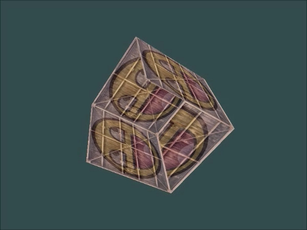

# Chapter 6. Coordinate Systems

* OpenGL 은 각각의 셰이더를 구동해서 나온 최종 결과물을 화면 상에 보이게 한다. 이 때 결과물은 **Normalized Device Coordinates** 의 좌표로 구성되며, 각 축마다 $$ (-1, 0) $$ 에서 $$ (1, 0) $$ 의 값을 가진다. 따라서 이 밖의 범위에 존재하는 좌표는 보이지 않는다.

* 하지만 NDC 만으로는 충분히 오밀조밀하게 넣어야 하는 단점이 있기에, **프로그래머가 스스로 정한 좌표 공간** 을 만들어 Custom Coordinates 의 좌표를 Matrix 변환을 통해 NDC 로 만들어야 한다. 그러면 NDC 의 좌표들은 다시 Screen 영역 상의 좌표 공간으로 변환되어 최종적으로 스크린에 표시된다.

* 어느 좌표 공간을 NDC 로 변환하고, 이를 다시 화면 공간의 좌표로 변환하는 것은 차례차례 단계적으로 이뤄진다. 여기서 알아야 할 중요한 *Coordinate Systems* 가 있다.

  1. Local Space (Object Space)
  2. World Space
  3. View Space (Eye Space)
  4. Clip Space
  5. Screen Space

  이 다섯가지 좌표 공간은 Vertex Data 가 Fragment 로 되기까지 거치는 각기 다른 상태를 가진 좌표계다.

## The Global Picture

한 공간의 좌표들을 다른 좌표계로 변형하기 위해서는 `model`, `view`, `projection matrix` 등을 알아야한다.


1. **Local coordinates**
   각각의 오브젝트에 관련된 상대 좌표로, 각 오브젝트의 원점에서 뻗어나가 좌표를 갖는다. 오브젝트가 맨 처음 가지는 좌표들이다.
2. Local coordinates 를 **World coordinates** 로 변환한다. World coordinates 는 세계 (World) 의 원점으로 뻗어나가는 좌표를 가지는 상대 좌표이다. 따라서 Local 좌표가 World 좌표로 변환됨에 따라 각각의 오브젝트가 World 에 배치된다.
3. World 공간의 좌표들을 **View-space coordinates** 로 변환한다. View-space 좌표는 카메라 혹은 뷰어의 시점을 원점으로 하여 뻗어나가는 좌표들을 가리킨다.
4. View-space 좌표들을 **Clip coordinates** 로 변환(투영) 한다. Clip 좌표는 $$ (-1, 0) $$ 에서 $$ (1, 0) $$ 까지의 좌표를 가지고 있으며 따라서 *무수한 vertices 가 스크린에 어떻게 투영이 될 지* 를 결정한다.
5. 마지막으로 Clip 좌표를 **Screen Coordinates** 로 변환한다. 이 과정에서 **Viewport transform** 을 불러, Clip 좌표들을 `glViewport` 에 정의된 `x` `y` `width` `height` 범위로 옮긴다. 그 후에 최종 좌표들이 *rasterizer* 에 보내져 *fragment* 로 변환된다.

### Local space

Local space 는 오브젝트에 대한 좌표 공간이다. 만약에 일반 3D 툴에서 큐브를 하나 생성했다고 하면, 그 큐브가 World space 에서 위치가 뭐가 됬던간에 오브젝트 자체의 원점은 $$ (0, 0, 0) $$ 일 것이다. 이 원점을 기준으로 큐브의 정점들이 이뤄진다. 따라서 한 오브젝트의 모든 정점은 Local space 안에 존재하게 된다.

짧막한 예를 들면, 현재 튜토리얼에서 쓰고 있는 $$ -0.5 $$ 에서 $$ 0.5 $$ 등의 정점 좌표는 한 오브젝트에 대한 Local 좌표이다.

### World space

만약 여러 오브젝트들을 무턱대고 World space 로 옮기게 되면 World 공간의 원점인  $$ (0, 0, 0) $$ 에 여러 겹으로 쌓여 꼴보기 싫은 장면을 보여줄 것이다. 따라서 큰 World space 에 오브젝트들을 적절한 위치에 놓이게끔 해야 한다. 
따라서 World space 는 Local space 의 오브젝트들의 정점을 변형해서, World 좌표계의 어딘가에 위치시킴으로써 오브젝트들을 적절한 위치에 보이게 한다. Local space 에서 World space 로 변환하는 과정은, **Model Matrix** 를 적용함으로써 이뤄진다.

**Model Matrix** 는 오브젝트를 World space 에 배치하기 위해서 *평행이동 / 회전 / 확대축소*를 하는 매트릭스이다. 이전 튜토리얼에서 본, `glm` 으로 Local 좌표들을 이래저래 만지작대던 것 또한 *model matrix* 의 일종이라고 볼 수 있다.

### View space

흔히 OpenGL 이나 Unity 등의 게임 엔진에서 **Camera** 라고 불리는 것이다. View space 는 World 공간의 좌표들을 실제 유저가 보게 되는 시점으로 변환한 좌표들의 결과다. 이 변환 과정 역시 World scene 자체를 *평행이동 / 회전 / 확대축소* 를 해서 카메라 앞의 시점으로 만든다. 이 과정은 *Model matrix* 가 그랬듯이, **View Matrix** 로 변환시킨다.

### Clip space

각 정점에 대해 버텍스 쉐이더 처리가 끝나면, OpenGL 은 반환된 좌표가 **특정 영역 안에 있는지** 확인하게 된다. 만약 특정 영역 안에 없다면, 해당 좌표는 잘려서 스크린 상에 보이지 않게 된다. *Clipped* 되기 때문에, 이 공간의 이름이 Clip space 라고 붙여졌다. 대개 해당 좌표는 NDC 기준을 따르기 때문에 $$ -1.0 $$ 과 $$ 1.0 $$ 사이에 좌표가 있지 않으면 Clipped 된다.

모든 정점 데이터를 NDC 범위 사이에 우겨넣는 것은 매우 비효율적이기 때문에, 사용자 정의 좌표 집합을 정해서 맘껏 부려놓고, 쉐이더에 입력으로 넘길 때는 NDC 범위로 변환하도록 해야한다. 

임의 뷰에 존재하는 정점 좌표를 NDC 기준을 만족하는 Clip 공간 좌표로 변환하게 하는 매트릭스를 **Projection Matrix** 라고 한다. 예를 들면 각 축당 $$ -1000 ​$$ 에서 $$ 1000 ​$$ 을 가질 수 있다. Projection matrix 는 저런 꼴을 가지는 뷰에 존재하는 공간 좌표를 NDC 범위 안으로 변형시킨다. 뷰의 범위 밖에 있는 좌표 역시 맵핑 되지만, NDC 공간 좌표 안에 없기 때문에 Clipped 된다.

> 여기서 주의해야 할 점은, 이 과정 역시 `primitive`를 만드는 과정 중 하나라는 것을 염두해야 하는 것이다. 만약 정점을 이루는 삼각형이 `clipping volume` 밖에 존재한다면, OpenGL 은 원래 정점으로 이뤄지는 삼각형을 재구성해서 NDC 안에 있는 정점으로만 원래 삼각형의 일부분을 만들 것이다.


Projection Matrix 가 만드는 *Viewing Box* 는 절두체의 형태를 가진다. 절두체는 위와 같이 각뿔에서 일정 부분을 잘라낸 것과 같은 도형을 말한다. 따라서 모든 좌표는 절두체 안에 존재하게 되고 이 절두체는 다시 NDC 와 Screen 좌표에 맵핑되서 최종적으로 스크린에 보여지게 된다.

특정 범위 안의 좌표들을 2D View-space 좌표로 쉽게 변환할 수 있는 NDC 좌표계로 변환하는 것을 **Projection**이라고 한다. 왜냐면 Projection matrix 는 3D 공간읕 2D NDC 로 변환할 수 있기 때문이다.

그리고 모든 정점들이 버텍스 쉐이더를 거친 후에는 Clip space 안에 존재하게 되는데, 이 때 Clipped 된 좌표를 제외한 모든 좌표는 `-W` 와 `W` 사이에서 값을 가지게 된다. 따라서 이것을 NDC로 변환하는 작업을 거친다. 이 작업을 **Projection Division** 이라고 부른다. 이 과정에서는 `vec4` 의 마지막 요소였던 `w` 축 값을 이용해 Clip 공간의 좌표를 `w` 값으로 나눈다. 그러면 $$ -1 $$ 과 $$ 1 $$ 사이의 NDC 좌표로 변환되는 것이다.

View 공간에서 Clip 공간으로 좌표를 변형하는데는 대략 두 가지 방법이 사용될 수 있다. 각각의 방법은 각기 다른 모양의 절두체를 사용한다.

1. **Orthographic** projection matrix
2. **Perspective** projection matrix

#### Orthographic projection

* Orthographic projection matrix 는, 거의 육방면체와 유사한 절두체를 가진다. 이 절두체는 Clip 공간을 정의한다.
* Orthographic projection matrix 을 만들 때, 실제 화면 상에 보일 절두체의 폭과 높이와, 길이를 정의할 수 있다. 절두체는 다음과 같은 모양을 가진다.


Orthographic 한 절두체는 정의를 할 때 `width`, `height` 와 `near`, `par` 과 같은 평면을 정의해서 만들어야 한다. `near` 평면 앞에 존재하는 모든 좌표는 Clipped 되고 `par` 평면 뒤에 존재하는 모든 좌표 역시 안 보이게 된다. 
절두체가 육방면체와 같기 때문에, Orthographic projection 은 `w` 가 $$ 1.0 $$ 이 아니지 않은 한 공간 안의 모든 좌표를 그대로 맵핑해버린다.

`glm` 의 함수를 통해서 간단하게 Orthographic Projection Matrix 을 만들 수 있다.

``` c++
glm::ortho(0.0f, 800.0f, 0.0f, 600.0f, 0.1f, 100.0f);
//			left  right	  bottom top	near  far
```

#### Perspective projection

* Perspective (원근법) 투영은 우리가 실제 세계에서 물체를 볼 때와 같이 투영하는 기법으로 어떤 물체를 멀리서 보면 실제 크기보다 매우 작아보이는 것을 흉내낸다.

원근법 투영 매트릭스는 Orthographic 과는 다르게 Frustum 안에 존재하는 모든 정점 좌표의 `w` 값을 조절한다. `near` 평면에 가까운 정점 좌표는 `w` 가 작을 것이고, `far ` 평면에 가까운 정점 좌표들은 `w` 가 클 것이다.

Orthographic Projection matrix 에서 Vertex 쉐이더 처리 이후에 모든 정점 좌표를 `w` 값으로 NDC 범위 안에 들어가게 했던 것과 같이, Perspective Projection Matrix 역시 같은 방법으로 unclipped 된 정점 좌표를 NDC 안에 맵핑한다. 다만, 여기서는 거리에 따라 `w` 값이 다 다르기 때문에 맵핑된 3차원 정점 좌표는 다음과 같은 식을 지니며, 결과로 모든 축이 $$ -1.0 $$ 에서 $$ 1.0 $$ 사이인 NDC 에 맵핑된다.
$$
out = \begin{pmatrix} x / w \\ y / w \\ z / w \end{pmatrix}
$$
Projection matrix 가 어떻게 좌표를 맵핑하는 지는 [OpenGL Projection Matrix](http://www.songho.ca/opengl/gl_projectionmatrix.html) 을 보면 된다.
Perspective Projection matrix 는 다음과 같이 `glm` 의 함수로 생성이 가능하다.

``` c++
glm::mat4 proj = glm::perspective(glm::radians(45.0f), (float)width/(float)height, 0.1f, 100.0f);
```


* `glm::perspective`
  1. `FoV` : 원근법 절두체의 폭을 결정한다. 크기를 늘리거나 줄임으로써 화면을 줌하거나 줌 아웃할 수 있다.
  2. `aspect` : 화면의 비율을 설정한다. $$ width / height $$ 이 일반적이다.
  3. `near`, `far`

> 만약 `near ` 값을 매우 크게 주면, 비디오 게임 등에서 어떤 물체를 통해서 화면을 보는 것과 같은 느낌을 줄 것이다.

Orthographic 과 Perspective Projection matrix 을 적용한 결과는 다음과 같다.


### 한번에 다 집어넣기

Local -> World -> View-space -> Clip 로 진행하면서 적용되는 매트릭스들을 한꺼번에 적용할 수 있다.
$$
\mathbf{V}_{clip} = \mathbf{M}_{projection} \cdot \mathbf{M}_{view} \cdot \mathbf{M}_{model} \cdot \mathbf{V}_{local}
$$
결과로 나온 $$ \mathbf{V}_{clip} $$ 벡터 값은 버텍스 쉐이더에서 `gl_Position` 에 할당되야 한다. 그러면 OpenGL 은 자동으로 Division 과 Clipping 및 Screen Space 로의 맵핑을 수행한다.

## Going 3D

3D 를 그리기 위해서는 **Model Matrix** 가 필요하다 (Local -> World). 따라서 다음과 같이 $$ {R}_4 $$ 의 4x4 배열을 만든다.

``` c++
glm::mat4 m_model;
m_model = glm::translate(m_model, cube_position[i]);
m_model = glm::rotate(m_model, 
                      static_cast<float>(glfwGetTime()) * glm::radians(-55.0f), glm::vec3(.5f, 1.f, 0.f));
```

여기서는 우선 객체를 World 에 대해 회전 시킨 후에, 평행이동을 하는 처리를 가진다. 모든 오브젝트는 최초 생성시에 World 에 대해 $$ (0, 0, 0) $$ 위치에 자리잡고 있기 때문에 평행 이동을 시켜줘야 다른 위치에서 보일 수 있다. 

사실 오브젝트가 다른 위치에서 보이게 끔 하기 위해 *카메라* 를 움직이는 방법도 있지만, 이 방법은 **View matrix** 에서 관여하는 부분이다. 그리고 OpenGL 은 오른쪽-손 좌표계로 물체를 인식하기 때문에 `Z` 축 방향으로 멀리 떨어지게 하고 싶다면 `Z` 값을 양수로 더해야 한다.

> **오른쪽-손 좌표계**
>
> 기본으로 OpenGL 은 NDC를 제외하고는 오른쪽-손 좌표계를 사용한다. 오른손을 쭉 뻗었을 때, 엄지가 오른쪽으로 되게 하고, 중지가 위를 향하게 하며, 중지가 앞으로 향하게 할 때 각 손가락이 가리키는 쪽이 각 축의 `+` 값이다. 따라서 +X 는 오른쪽, +Y 는 위쪽, +Z 는 앞쪽이 된다.
>
> DirectX 의 경우에는 왼쪽-손 좌표계를 사용한다. +Y 의 방향은 같지만, +X 와 +Z 는 반대 방향이 된다. 위에서도 언급했지만, OpenGL 또한 사실 NDC 이후로는 왼쪽-손 좌표계를 사용한다. 이는 *Projection Matrix* 가 오른손 좌표계를 왼손으로 변형하기 때문이다.

그리고 *view matrix* 와 *projection matrix* 역시 만들어준다.

``` c++
glm::mat4 m_view;
m_view = glm::translate(m_view, glm::vec3(0, 0, -3.f));
glm::mat4 m_proj;
m_proj = glm::perspective(glm::radians(50.f),
                          (float)(SCREEN_WIDTH) / SCREEN_HEIGHT,
                          0.1f,
                          100.f);
```

이제 Model matrix 와 View, Projection matrix 를 **Shader** 에 입력으로 보내 최종 좌표를 `gl_Position` 에 출력해야 한다. 정점 쉐이더는 다음과 같다.

``` c++
#version 330 core
out vec2 TexCoord;

layout (location = 0) in vec3 aPos;
layout (location = 1) in vec2 aTexCoord;

uniform mat4 model;
uniform mat4 view;
uniform mat4 proj;

void main() {
    gl_Position = proj * view * model * vec4(aPos, 1.0f);
    TexCoord = aTexCoord;
}
```

 이제 쉐이더를 켜고, `uniform` 타입의 매트릭스 3개를 `glGetUniformLocation` 함수로 불러, `glUniformMatrix4fv` 로 매트릭스의 시작 지점을 포인터로 반환하면 된다.

## More 3D

2D 면을 3D 큐브로 확장하기 위해서는 번거롭지만 총 36개의 정점이 필요하다. (6 면 * 2 개의 삼각형 프리미티브 * 삼각형 하나 당 3개의 정점). 적절하게 구현 한 후에, Model matrix 를 오브젝트를 시간에 따라서 회전하게 한 뒤, 묘화를 하고 실행을 시키면 회전하는 정육면체를 볼 수 있다.



근데 자세히 살펴보면 정육면체의 뒷부분이 앞으로 튀어나오는 현상을 볼 수 있다. 이 현상은 OpenGL 이 정육면체를 삼각형 단위로 그리면서 최종 좌표계에 이전에 그려진 픽셀 위에 새로 그려진 **픽셀이 덮어 쓰이기** 때문이다. 

이 현상을 막기 위해 OpenGL 가 제공하는 기능인 `z-buffer` 을 써서 어느 픽셀을 그리고 어느 픽셀을 덮어씌우지 말지 설정해줄 수 있다.

### Z-buffer

OpenGL 은 **Depth buffer** 라고 알려진, **Z-buffer** 에 오브젝트에 관련된 모든 깊이 정보를 저장한다. 이 버퍼는 출력 이미지의 색상을 저장하는 컬러 버퍼와 비슷한 역할을 지닌다. 

*깊이* 는 각 프래그먼트에 `z` 축 값으로 저장될 수 있고, 각 프래그먼트가 화면에 색을 출력하고 싶을 때, OpenGL 은 Z-buffer 의 깊이 값들을 비교한다. 만약 현재 프래그먼트가 다른 프래그먼트보다 뒤에 있다면 현재 프래그먼트는 스크린에 보여지지 않는다. 이 과정을 **Depth testing** 라고 부른다.

하지만 이 과정을 처리하기 위해서는 OpenGL 에게 depth testing 을 별도로 처리해달라고 요청해야 한다. `glEnable()` 을 사용해서 OpenGL 의 특정 기능을 활성화시키거나 비활성화 시킬 수 있다. depth testing 을 쓰기 위해서는 `GL_DEPTH_TEST` 을 인자로 보내야 한다.

또한 각 렌더링 프레임마다 Z-buffer 를 초기화시켜야 프래그먼트의 깊이 정보가 새로 저장되기 때문에 `glCear` 함수로 Z-buffer 을 초기화 시킨다.

``` c++
glEnable(GL_DEPTH_TEST);
glClear(GL_COLOR_BUFFER_BIT | GL_DEPTH_BUFFER_BIT);
```

같은 오브젝트를 여러 개 만들어서 World 공간에 배치할 수 도 있다.

``` c++
glm::vec3 cube_position[] = {
    glm::vec3(0.0f,  0.0f,  0.0f),
    glm::vec3(2.0f,  5.0f, -15.0f),
    glm::vec3(-1.5f, -2.2f, -2.5f),
    glm::vec3(-3.8f, -2.0f, -12.3f),
    glm::vec3(2.4f, -0.4f, -3.5f),
    glm::vec3(-1.7f,  3.0f, -7.5f),
    glm::vec3(1.3f, -2.0f, -2.5f),
    glm::vec3(1.5f,  2.0f, -2.5f),
    glm::vec3(1.5f,  0.2f, -1.5f),
    glm::vec3(-1.3f,  1.0f, -1.5f)
};
//...
while (!glfwWindowShouldClose(window)) {
    for (auto i = 0u; i < 10; ++i) {
        glm::mat4 m_model;
        m_model = glm::translate(m_model, cube_position[i]);
        m_model = glm::rotate(m_model, 
                  (float)(glfwGetTime()) * glm::radians(-55.0f), 
                  glm::vec3(.5f, 1.f, 0.f));

        glUniformMatrix4fv(glGetUniformLocation(id, "model"), 1,
                           GL_FALSE, 
                           glm::value_ptr(m_model));
 
        glBindVertexArray(VAO);
        glDrawArrays(GL_TRIANGLES, 0, 36);
    }
}
```


