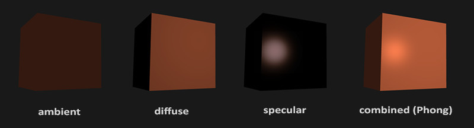

# Chapter 8. Colors

실제 세계에서, 색이라는 것은 각각의 물체가 가지고 있는 특유의 고유한 *값*들이다. 디지털 세계에서는 무한히 존재하는 색의 값을 한정된 디지털 세계의 색의 값으로 변경해야 한다. 일반적인 색들은 `RGB` 라고 하는 빨강 초록 그리고 파랑색의 값들로 표현된다. 예를 들어서 산호색은 다음과 같이 표현될 수 있을 것이다.

``` c++
glm::vec3 coral(1.0f, 0.5f, 0.31f);   
```

실제 세계에서 우리가 보는 물체들의 색은, 그 물체가 직접 발하는 색이 아니라 거의 모든 색을 가지고 있는 태양광에서 반사되어 우리 눈에 들어오는 색일 뿐이다. 예를 들면 태양광이 `주황색`을 **띄고 있는** 물체에 맞닿았을 때, `주황색`계열의 색만이 반사되어 우리 눈에 들어온다. 그러면 우리는 이 물체를 `주황색`이라고 인식하게 되는 것이다.

이런 법칙은 디지털 세계에서도 그대로 적용할 수 있다. 

1. 우선 하얀색을 나타내는 `vec3` 변수를 태양광으로 둔다.
2. 해당 오브젝트의 고유 색을 `vec3` 등을 선언한다.
3. 셰이더 혹은 프로그램 코드 상에서 이 둘을 곱하면 반사된 최종 색이 나온다.
4. Profit!

``` c++
glm::vec3 lightColor(1.0f, 1.0f, 1.0f);
glm::vec3 toyColor(1.0f, 0.5f, 0.31f);
glm::vec3 result = lightColor * toyColor; // = (1.0f, 0.5f, 0.31f);
```

실제 세계에 빗대어서 말하면, *toy* 는 *light* 의 빛을 대부분 흡수하고, `(1, 0.5, 0.31)` 에 해당하는 빛만 우리 눈으로 반사시킨다. 만약에 태양광이 뭔가의 이유로 초록색만 발했을 때는 다음과 같을 것이다.

``` c++
glm::vec3 lightColor(0.0f, 1.0f, 0.0f);
glm::vec3 toyColor(1.0f, 0.5f, 0.31f);
glm::vec3 result = lightColor * toyColor; // = (0.0f, 0.5f, 0.0f);
```

``` c++
glm::vec3 lightColor(0.33f, 0.42f, 0.18f);
glm::vec3 toyColor(1.0f, 0.5f, 0.31f);
glm::vec3 result = lightColor * toyColor; // = (0.33f, 0.21f, 0.06f);
```

## A lighting scene


## Basic Lighting

실제 세계의 빛은 매우 복잡하기 때문에, 컴퓨터의 한정된 자원을 가지고는 실제 세계의 빛을 온전히 다 구현하는 것은 힘들다. 따라서 OpenGL 의 조명 모델은 실제 세계와 비슷해 보이면서도 매우 효율적으로 빛을 구현할려고 하고 있다. 이런 조명 모델들은 빛의 물리학에 기존하고 있는데, 그 중의 하나는 **Phong lighting model** 이다.

**Phong lighting model** 은 3개의 요소로 구성된다.



* Ambient Lighting (환경 조명)
  실제 세계의 밤과 같이, 매우 어두워도 아주 미세한 조명은 있기 마련이다 (달이라던가, 먼 조명이라던가). 그래서 오브젝트들은 빛이 없을 때에도 완전히 검지는 않다. 이를 시뮬레이팅 하기 위해서 **환경 조명**을 추가해 주광원이 없더라도 약간의 색을 주도록 해야한다.
* Diffuse Lighting (확산 조명)
  조명 모델에서 가장 중요하며, 물체에 직접적인 조명 영향을 시뮬레이팅 한다. 주광원의 밝기에 따라서 객체가 받는 영향 역시 커진다.
* Specular Lighting (경면 조명)
  객체가 빛나는 정도에 따라 밝은 부분을 강조하거나 하는 형태로 시뮬레이트하는 조명 기법이다. 강조된 부분은 오브젝트의 실제 객체보다는 주광원의 색을 보이는 경향이 있다.

## Ambient Lighting

빛은 단 한 개의 광원이 아니라 여러 개의 광원에서 동시에 빛을 뿜어대는 것이 보통이다. 빛의 중요한 한 특성은 빛은 퍼질 수 있고 반사되서 간접적인 광원이 될 수 있다는 것이다. 사실 여러 개의 *주 광원* 과 여러 개의 더 많은 *간접 광원* 을 고려해서 최종적인 색상을 내는 법은 매우 복잡하고 고사양을 요구한다. 이렇게 하는 방법을 **global illumination** 알고리즘 이라고 한다.

여기서는 위의 방법 대신에 가장 간단한 **ambient lighting** 을 쓰기로 한다. ambient lighting 을 구현하는 방법은 매우 쉽다. 쉐이더에서 빛의 색을 가져와, 미리 정해진 **ambient factor** 을 곱해 최종 오브젝트 색깔에 반영한다.

``` c++
void main() {
    float ambientStrength = 0.1;
    vec3 ambient = ambientStrength * lightColor;

    vec3 result = ambient * objectColor;
    FragColor = vec4(result, 1.0);
}  
```


## Diffuse Lighting

환경 조명과는 다르게 확산 조명은 개개의 오브젝트에 매우 큰 조명 영향을 끼친다. 확산 조명은 오브젝트의 각각의 프래그먼트가 광원에 가깝거나 정렬되어 있을 때 빛의 영향을 더 많이 받게 된다.


예시를 들어 설명하면, 왼쪽에 주광원이 있고 이 주광원은 현재 오브젝트의 한 프래그먼트 면을 비추고 있다. 이제 우리는 주광원이 프래그먼트에 얼마의 각도로 비추고 있는 지를 계산해야 한다.

만약 빛이 오브젝트의 면에 대해서 *직각* 이면, 가장 큰 영향을 준다. 입사각을 측정하는 방법은 프래그먼트의 표면에 직각인 **normal vector** 을 사용해 입사각을 구하는 것이다. 이는 내적 (dot product) 을 통해서 쉽게 구할 수 있다.
$$
\mathbf{L} \cdot \mathbf{\overline{N}} = | \mathbf{L} || \mathbf{\overline{N}}|\cos{\theta} \\
\theta = \arccos{ \frac{ \mathbf{L} \cdot \mathbf{\overline{N}} }{ | \mathbf{L} || \mathbf{\overline{N}}| }}
$$
만약 $ \theta $ 가 일반 각도로 90 을 넘게 된다면, 내적의 값은 0 보다 작거나 같을 것이다. 즉, 확산 조명의 영향을 받지 않고 환경 조명에만 영향을 받는다는 말이 된다. 그런데, 위의 경우에는 조명의 벡터와 법선 벡터의 크기가 $ 1 $ 이 아니기 때문에, 계산 성능을 위해 $ \mathbf{L} $ 과 $ \mathbf{\overline{N}} $ 벡터를 유닛 벡터로 바꿔야 한다.

따라서 확산 조명을 계산하기 위해서는 다음이 필요하다.

1. **Normal vector (법선 벡터)**
2. **Fragment 에 대한 조명의 방향**
   이를 계산하기 위해서는, 프래그먼트의 위치 벡터와, 빛의 위치 벡터가 필요하다. 

### Normal vector

정점이 만들어 이루어지는 프래그먼트에 수직인 법선 벡터를 말한다. 하지만 프리미티브가 이루어져 프래그먼트가 되기 전의 정점 데이터 자체는 단지 하나의 점이기 때문에 어느 하나의 **정점을 둘러 싼 다른 정점들을 이용해** 법선 벡터를 구해야 한다. 

가장 일반적인 방법은, 삼각형 프리미티브를 이루는 각 정점에 대해 한 지점에서 뻗어나가는 두 개의 벡터를 외적을 하게 해 법선 벡터를 구하는 방법이 있다. 일단 튜토리얼에서는 미리 법선 벡터를 구해놓은 상태다.

1. 따라서 맨 첫번째로 정점 데이터 배열에 있는 법선 벡터들을 읽어오기 위한 세팅을 한다.
   Vertex Shader 에서는 `location` 을 지정해 Normal 벡터를 읽어오며, 코드에서는 `glVertexAttribPointer` 함수로 법선 벡터를 VAO 에 지정할 수 있도록 한다.

> 여기서 잠시 짚고 넘어갈 점은, 다른 VAO 에 대해 같은 VBO 을 지정할 수 있는데 이 때 VBO 는 별도의 데이터 공간이 소비되지 않고 VRAM 에 상주하는 같은 VBO 을 쓰기 때문에 메모리 효율에 대해 염려할 필요가 없다.

2. 그리고 Fragment Shader 에서 **법선 벡터** 와 **광원의 위치** 를 받아와 **확산 광원에 의한 최종 색**을 만들어낸다. Fragment Shader 의 최종 코드는 다음과 같다. 확산 광원의 거리에 따른 영향까지 고려한 상태이다.

``` c++
#version 330 core
out vec4 FragColor;
in	vec3 Normal;
in	vec3 FragmentPos;

uniform vec3 lightColor;
uniform vec3 lightPos;
uniform vec3 objectColor;

void main() {
	float AMBIENT_STRENGTH = 0.1f;
	float DIST_LIMIT= 10.0f;
	// Get a ambient color
	vec3 ambient	= AMBIENT_STRENGTH * lightColor;
	// Get light direction unit vector and light vector to calculate diffuse color 
	vec3 normal		= normalize(Normal);
	vec3 lightVec	= lightPos - FragmentPos;
	vec3 lightDir	= normalize(lightVec);
	// Get a diffuse color factor
	float diff		= max(dot(normal, lightDir), 0.0);
	// Get a diffuse intensity factor, boundary is 10.0f
	float distance	= min(sqrt(dot(lightVec, lightVec)), DIST_LIMIT);
	vec3 diffuse	= (diff * (DIST_LIMIT - distance) / DIST_LIMIT) * lightColor; 
	// Apply to it and get a final result color
	vec3 result		= (ambient + diffuse) * objectColor;
    FragColor		= vec4(result, 1.0); 
}
```

다음과 같이 나온다.


### One last thing

아까 전에 우리는 법선 벡터를 직접 넘겨줘서 이를 Fragment Shader 에서 쓰게 했었다. 하지만 프래그먼트 쉐이더에서 행한 연산들은 죄다 World 공간 좌표를 기준으로 했기 때문에 차라리 그럴거면 아예 법선 벡터도 World 공간의 좌표로 변형하면 되지 않을까 생각을 할 지도 모른다. 기본적으로는 가능은 하나, 단순히 Model Matrix 을 이용해 변형하는 만큼 간단하지는 않다.

왜냐면, **Normal vector** 는 오직 방향만을 가리키는 벡터이고, 공간의 구체적인 정보는 가리키고 있지 않기 때문이다. 또한 노멀 벡터는 `w` 축을 가지고 있지 않다. 이 말인 즉슨 `w` 을 이용한 *Projection Division* 은 법선 벡터에 아무런 영향을 주지 않는다. 
따라서 만약에 Normal vector 을 World 공간 좌표 상으로 변형하고 싶다면, `w` 와 평행이동 부분을 제외한 좌상단 기준으로 3x3 매트릭스 만을 취해서 이를 곱해야 한다. (사실, `w` 을 0 으로 두면 3x3 매트릭스를 취한 효과와 같이 된다)

두번째로, 만약 *Model matrix 가 non-uniform 한 확대 / 축소를 시행하면*, 정점의 위치는 다음과 같이 변할 것이고 따라서 Normal vector 는 변형 이전의 표면에 대해 직각이었던게 더 이상 직각이 아니게 된다. 밑의 이미지는 *non-uniform* 한 Model matrix 을 적용할 때 일어나는 상황을 나타낸다.


이 부작용을 해결하는 방법은 법선 벡터만을 위해 만들어진 특별한 Model matrix 를 쓰는 것이다. 이 matrix 를 **Normal Matrix** 라고 부르며 위와 같은 상황이 일어났을 때 normal vector 을 바로 잡기 위해서 쓰인다. 사실 거의 모든 그래픽스에서는 Normal matrix 을 **model-view matrix** 가 적용된 후의 것으로 정의하고 있지만, 여기서는 model matrix 만 적용한 것만 반영하기로 한다.

``` c++
Normal = mat3(transpose(inverse(model))) * aNormal;  
```

이 떄 알아야 할 점은, **Model matrix 을 적용한 normal matrix** 는 `inverse` ' 모델 매트릭스의 좌상단의 역행렬의 $$ \mathbf{T} $$ ' 라는 점이다. 그래서 Shader 에서 Normal matrix 을 구할 떄, 위와 같이 OpenGL 의 built-in 함수를 써서 구한다.

> 다만 GPU 에서 역행렬을 구하는 처리는 매우 비효율적이면서도 성능을 저하할 수 있는 원인이 될 수 있기 때문에, 가능하면 실 프로그램에서는 CPU 가 연산을 하게끔 하는 것이 좋다.

## Specular Lighting

확산 조명과는 같이 Specular Lighting 은 **빛의 방향 벡터** 와 **객체의 프래그먼트의 법선 벡터** 에 연산 기반을 두고 있지만, 또한 유저 또는 카메라가 프래그먼트를 **보는 방향** 에 대해서도 연산 기반을 둔다. Specular lighting 은 빛의 반사되는 성질에 기반을 둔다. 객체의 프래그먼트가 거울과 같다고 하면, 반사광은 가장 강할 것이다. 반대로 프래그먼트가 아주 울퉁불퉁하다고 하면 반사광은 가장 약할 것이다.


1. 우선 법선 벡터와 빛의 방향을 연산해서 **Reflection vector** (반사 벡터) 를 만든다. 그리고 카메라가 프래그먼트를 보는 방향과 반사 벡터의 방향 사이의 각도, $$ \theta $$ 을 구한다. 이 $$ \theta $$ 가 $$ 0 ^{\circ} $$ 에 가까울 수록 반사광은 강해지게 된다. 반사광이 강해질 수록 카메라는 더 강한 빛을 포착하게 되는 것이다.

2. View vector 는 반사광을 구하기 위해 필요한 추가 변수이다. 그리고 이것을 Shader 혹은 CPU 제어 코드에서 프래그먼트의 위치와 카메라의 World 공간 좌표를 이용해 구할 수 있다. 그리고 이 반사광의 *강도*를 구해 light color 에 곱한 다음 환경과 확산 조명에 더해 최종 색을 구한다.

   > 여기서 알아둬야 할 점은, 일반적으로는 **View space** 을 기준으로 반사광을 구한다는 점이다. 이 이유인 즉슨 View space 에서는 카메라의 위치가 원점이기 때문에 별도의 계산을 하지 않아도 된다는 장점이 있다.

3. 따라서 다음과 같이 Fragment Shader 을 고친다. 우선 World space 에 대해서 총 조명을 계산하기 때문에 카메라 위치를 `uniform` 으로 입력 해줘야 한다. (View space 로 고치면 좀 더 편해지지만 나중에 하기로 한다)

``` c++
#version 330 core
out vec4 FragColor;
in	vec3 Normal;
in	vec3 FragmentPos;

uniform vec3 lightColor;
uniform vec3 lightPos;
uniform vec3 objectColor;
uniform vec3 viewPos;

void main() {
	float AMBIENT_STRENGTH = 0.1f;
	float DIST_LIMIT= 20.0f;
	float SPECULAR_LIMIT = 0.5f;
	int	  SPECULAR_INTENSITY = 64;

	// Ambient
	vec3 ambient	= AMBIENT_STRENGTH * lightColor;
	vec3 normal		= normalize(Normal);
	vec3 lightVec	= lightPos - FragmentPos;
	vec3 lightDir	= normalize(lightVec);

	// Diffuse
	float diff		= max(dot(normal, lightDir), 0.0);
	float distance	= min(sqrt(dot(lightVec, lightVec)), DIST_LIMIT);
	vec3 diffuse	= (diff * (DIST_LIMIT - distance) / DIST_LIMIT) * lightColor; 

	// Specular
	vec3 cameraDir	= normalize(viewPos - FragmentPos);
	vec3 reflectDir = reflect(-lightDir, normal);
	float spec_amt	= pow(max(dot(cameraDir, reflectDir), 0.0), SPECULAR_INTENSITY);
	vec3 specular	= SPECULAR_LIMIT * spec_amt * lightColor;
	// 합친 벡터의 값은 1.0f 을 넘을 수 있다. 반사광의 강조색처럼 색이 날아가게 되는 것임.
	vec3 result		= (specular + ambient + diffuse) * objectColor;
    FragColor		= vec4(result, 1.0); 
}
```

결과는 다음 스크린샷처럼 나온다. 반사광이 보이는 것을 알 수 있다. 


>초창기 조명 셰이더는, Phong 조명 모델을 Vertex Shader 안에 넣어서 처리하곤 했었다. 이 방식으로 조명을 처리하는 방식을 **Gouraud Shading** 이라고 부른다. 이 방식의 장점은 입력받은 정점에 대해서만 조명 연산을 수행하기 때문에 Fragment Shader 에 비해 매우 빠르다는 장점이 있다. 하지만 버텍스 적으면 적을 수록 결과물은 매우 조악했기 때문에 현재 성능이 많이 상향된 지금은 **Phong Shading (per-pixel based shading, per-fragment shading)** 을 쓰고 있다.
>
>

