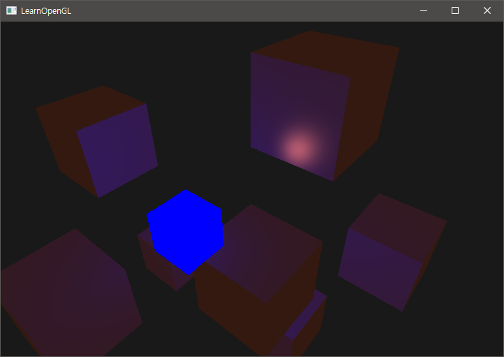
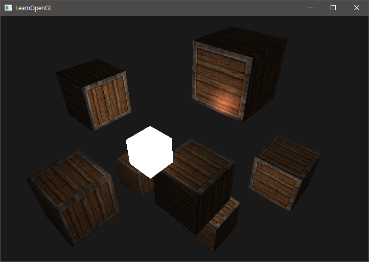
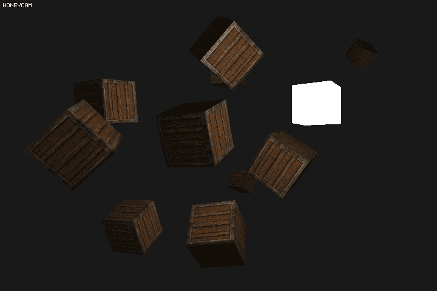

# Chapter 9. Materials

실 세계에서는 각각의 물체들이 서로 다른 재질을 가지고 있기 때문에 빛나는 정도 역시 다르다. 철제 물체는 빛을 잘 받아 좀 더 잘 빛나고, 고무나 나무와 같은 물체는 철제보다는 그렇게 빛의 영향을 받지 않는다. 즉, **각각의 오브젝트마다 반사광에 영향을 받는 정도**가 다르다.

어느 한 물체는 반사광이 사방으로 퍼지지 않아 작지만 강한 하이라이트를 남기는 반면에 다른 것은 큰 반경으로 하이라이트를 남기는 것도 존재한다. 각각의 다른 재질을 가진 물체마다 조명의 영향을 달리할 수 있도록 해보자.

우선 Chapter 8 에서 만든 정점 셰이더와 프래그먼트 셰이더에 재질만의 고유의 속성 (**ambient, diffuse, specular**) 을 추가해야 한다. 여기서는 Phong 조명 모델을 쓸 예정이기 때문에 fragment shader 에 쓴다.

``` c++
#version 330 core
struct Material {
    vec3 ambient;
    vec3 diffuse;
    vec3 specular;
    float shininess;
}; 
  
uniform Material material;
```

GLSL 은 `struct` 을 쓸 수 있어 기본적인 POD 컨테이너를 제공한다. 컨테이너 안의 오브젝트에 값을 쓰기 위해서는 `material.ambient` 와 같은 식으로 쓴다. 다만 이 `struct` 구조체는 `in` 또는 `out` 으로 각각 쉐이더 밖으로 보내는 것이 불가능하다.

우선 `ambient` 는 환경 조명에서 어느 빛을 반사해서 보이게 할 지를 정한다. 대개 `diffuse` 에 설정된 컬러와 같다. `diffuse` 는 일반적으로 오브젝트의 원 색상을 정할 때 쓴다. `specular` 와 `shininess` 는 반사 조명에서 반사할 빛의 색과 난반사 강도(역비례)를 정할 때 쓴다.


위 그림을 보면, `diffuse`가 같다고 하더라도 `specular` 가 다른 것이 있는가 하면, `ambient` 가 각기 다르게 설정된 것도 있다.

## Setting Materials

이제 `glUniformGetLocation` 등의 함수로 `material` 에 적절한 값을 넣어 물체의 조명이 제대로 반영되는 지 알아본다. Fragment 쉐이더의 코드는 다음과 같다.

``` c++
void main() {    
    // ambient
    vec3 ambient = lightColor * material.ambient;
  	
    // diffuse 
    vec3 norm = normalize(Normal);
    vec3 lightDir = normalize(lightPos - FragPos);
    float diff = max(dot(norm, lightDir), 0.0);
    vec3 diffuse = lightColor * (diff * material.diffuse);
    
    // specular
    vec3 viewDir = normalize(viewPos - FragPos);
    vec3 reflectDir = reflect(-lightDir, norm);  
    float spec = pow(max(dot(viewDir, reflectDir), 0.0), material.shininess);
    vec3 specular = lightColor * (spec * material.specular);  
        
    vec3 result = ambient + diffuse + specular;
    FragColor = vec4(result, 1.0);
}
```

그리고 쉐이더를 가동시켜, 쉐이더에 적절한 값을 집어넣는다.

``` c++
lightingShader.setVec3("material.ambient",  1.0f, 0.5f, 0.31f);
lightingShader.setVec3("material.diffuse",  1.0f, 0.5f, 0.31f);
lightingShader.setVec3("material.specular", 0.5f, 0.5f, 0.5f);
lightingShader.setFloat("material.shininess", 32.0f);
```

그런데 값을 집어넣고 실행을 시키면, 물체에 그림자가 지고 하이라이트가 뜨는 것은 되지만 색이 너무 밝은 것을 느낄 수 있다. 이렇게 되는 이유는, `lightColor` 가 $$ (1.0, 1.0, 1.0) $$ 일 때 ambient + diffuse + specular 의 값이 1.0 보다 높거나 그에 상응한 값을 결과물로 내놓기 때문에 색이 전부 날아가는 현상이 발생한다.

따라서 `Light` 에도 `ambient`, `diffuse`, `specular` 각각의 상황에서의 빛 정도를 입력해 적절한 조명이 비춰지도록 해야한다.

그래서 다음은 `Light` 구조체를 만든 후의 Fragment Shader 의 코드다. 여기서 `LightPos` 변수는 조명의 View space 의 좌표를 나타낸다. 이 좌표는 Vertex Shader 에서 변형되어 입력으로 받기 때문에 `uLight` 의 구조체에는 들어가지 않는다. (`uniform` 으로 선언된 변수의 값은 항상 `const` 이다)

``` c++
#version 330 core
// Light properties && struct can't let it out or put them in.
struct uLight {
	vec3 ambient;			// light Colors
	vec3 diffuse;
	vec3 specular;
};

out vec4 FragColor;
in	vec3 Normal;			// in view space
in	vec3 FragmentPos;		// in view space
in	vec3 LightPos;			// in view space

// Object color properties
struct Material {
	vec3 ambient;
	vec3 diffuse;
	vec3 specular;

	float intensity;
};

uniform Material uMaterial;
uniform uLight Light;

void main() {
	float DIST_LIMIT= 20.0f;
	float SPECULAR_LIMIT = 0.5f;

	// Ambient
	vec3 ambient	= Light.ambient * uMaterial.ambient;

	// Diffuse
	vec3 normal		= normalize(Normal);
	vec3 lightVec	= LightPos - FragmentPos;
	vec3 lightDir	= normalize(lightVec);
	float diff		= max(dot(normal, lightDir), 0.0);

	float distance	= min(sqrt(dot(lightVec, lightVec)), DIST_LIMIT);

	vec3 diffuse	= (diff * (DIST_LIMIT - distance) / DIST_LIMIT) * uMaterial.diffuse * Light.diffuse; 

	// Specular
	vec3 cameraDir	= normalize(-FragmentPos);
	vec3 reflectDir = reflect(-lightDir, normal);
	float spec_amt	= pow(max(dot(cameraDir, reflectDir), 0.0), uMaterial.intensity);

	vec3 specular	= SPECULAR_LIMIT * spec_amt * uMaterial.specular * Light.specular;

	// Result
	vec3 result		= specular + ambient + diffuse;
    FragColor		= vec4(result, 1.0); 
}
```

그리고 프로그램 코드는 다음과 같이 넣는다.

``` c++
// ...
shader_object->SetVec3f("lightPosition", light_position);

// Fragment Shader uniform variables
shader_object->SetVec3f("Light.ambient", 0.2f * light_color);
shader_object->SetVec3f("Light.diffuse", glm::vec3(0, 0, 1));
shader_object->SetVec3f("Light.specular", light_color);

shader_object->SetVec3f("uMaterial.ambient", 1.f, .5f, .31f);
shader_object->SetVec3f("uMaterial.diffuse", 1.f, .5f, .31f);
shader_object->SetVec3f("uMaterial.specular", 1.f, .5f, .31f);
shader_object->SetFloat("uMaterial.intensity", 64.0f);
glBindVertexArray(VAO);
// ...
```

결과로 다음과 같이 조명이 제대로 들어온 것을 확인할 수 있다.



## Lighting Maps

위 튜토리얼의 경우에는 무늬가 없는 아주 단순한 육면체를 생성해서 거기에 조명을 적용시켰을 뿐이다. 하지만 실제 현실 세계에 존재하는 물체은 무늬가 없는 경우는 아주 없을 뿐더러 오히려 여러가지 복잡한 형태가 조명을 받아 다양한 색을 반사하고 있다. 

차를 생각해보면, 외장재는 빛나는 자재 및 구조로 이루어져 있으며, 거기에 달려있는 창문은 주위 환경을 반사할 뿐더러 타이어도 조명의 영향을 받지만 하이라이트가 없다. 차량의 외장의 테두리나 꺾인 부분은 매우 큰 반사광을 방출한다. *차*라는 것은 매우 다른 `ambient` 와 `diffuse` 및 `specular` 값들로 이루어져 있다.

따라서 위 튜토리얼 만으로는 실제 세계를 구현하기에는 매우 부족하다. 그러나 **Diffuse Maps** 와 **Specular Maps** 을 통해 여러 텍스쳐를 불러와서 각기 다른 조명 반영 값을 입력함으로써 현실 세계를 흉내내는 것에 한 발짝 더 다가갈 수 있다.

## Diffuse Maps

Diffuse map 은 **텍스쳐**를 이용해서 객체의 Diffuse color 을 표현하는 방식이다. 따라서 쉐이더에 텍스쳐의 정보를 받기 위한 Sampler 가 필요하고, 각 버텍스에 대한 텍스쳐의 좌표 배열이 필요하다. 텍스쳐에서 바로 `diffuse color`을 뽑아낼 예정이기 때문에 별도의 `vec3` 의 diffuse 값 벡터는 필요치 않다. (ambient, specular 역시 동일) (다만 Specular 는 Specular maps 에서 별도로 다룰 예정)

``` c++
// 9_diffuse.frag

// Object color properties
struct uMaterial {
	sampler2D texture;
	vec3 specular;
	float intensity;
};
in	vec2 TexCoord;

uniform uMaterial	Material;
uniform uLight		Light;
```

``` c++
// 9_diffuse.vert

out vec3 Normal;
out vec3 FragmentPos;
out vec3 LightPos;
out vec2 TexCoord;

layout (location = 0) in vec3 aPos;
layout (location = 1) in vec3 aNormal;
layout (location = 2) in vec2 aTexCoord;
```

이전의 튜토리얼대로 텍스쳐 버퍼를 만들어 주고 샘플러에 Location 을 지정해 준 뒤, 바인드 하고 세팅해주면 다음과 같이 텍스쳐가 입혀진 사각박스들에 조명이 씌워진 것을 확인할 수 있다.



하지만 나무 재질은 윤칠이라도 하지 않는 이상 저렇게 반사광이 심하게 날 리가 없다. 모서리의 철제로 된 **특정 부분만** 반사광을 넣게 하고 싶다면 **Specular Maps** 을 쓰면 된다.

## Specular Maps

텍스쳐의 특정 부분 (혹은 프래그먼트의 특정 부분만) Specular 하이라이트를 넣고 싶을 때, **또 다른 Texture map** 을 써서 부분광을 구현할 수 있다. 이 때 쓰일 텍스쳐는 흑백의 회색조로 이루어진 텍스쳐를 받아서 넣어야 한다. 


박스에서 모서리의 철제 부분만 반사광을 넣기로 했기 때문에, 중앙의 나무 재질 부분은 검고 모서리 부분은 명암을 가진다. 각 픽셀의 밝기에 따라 `vec3(0.0)` 에서 `vec3(1.0)` 까지의 값을 갖게 되고 이것을 쉐이더 프로그램 내부의 반사광을 구하는 코드에 반영하면 될 것이다.

> 기술적으로 나무 역시 아주 약한 반사광을 가지고 있지만, 여기서는 무시하기로 한다.
> 포토샵이나 Gimp 등과 같은 이미지 편집 툴로 Specular Maps 에 쓰일 텍스쳐를 간단히 생성할 수 있다.

Fragment Shader 에 적절하게 넣고, 반영을 한 뒤에 텍스쳐를 바인딩해 돌리면 다음과 같이 철 부분만 반사광이 비치는 것을 알 수 있다.



## Emission Map

오브젝트가 조명에 영향을 받을 때에도 조명에 관계 없이 빛을 발할 수 있는 텍스쳐 맵핑이 있는데, 이것을 Emission Map 이라고 한다. 대개 텍스쳐만 맵핑하지 않고 HDR 등과 같은 기법을 적용해 주위에 빛을 발하게 하기도 한다.