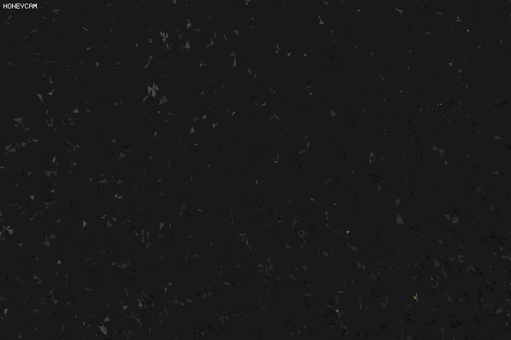

# Chapter 20. Geometry Shader

Vertex 와 Fragment shader 사이에는 **Geometry shader** 라는 것이 있다. 이 쉐이더는 정점 쉐이더에서 뽑혀져 나온 정점 집합들을 가지고 **Primitive** 을 만드는 역할을 한다. 따라서 지오메트리 쉐이더는 정점들을 가공해서 잘 맞는 형태를 만든 다음에 이것들을 다음 스테이지로 보내는 역할을 하고 있는 셈이다.

지오메트리 쉐이더 역시 Programmable 하기 때문에 이것들을 잘 이용해서 정점들을 조작해서 원하는 모형을 만들 수 있거나 전혀 다른 모양의 프리미티브 집합들을 만들어 낼 수 있다.

우선 지오메트리 쉐이더 프로그램의 코드는 다음과 같다.

``` c++
#version 330 core
layout (points) in;
layout (line_strip, max_vertices = 2) out;

void main() {    
    gl_Position = gl_in[0].gl_Position + vec4(-0.1, 0.0, 0.0, 0.0); 
    EmitVertex();

    gl_Position = gl_in[0].gl_Position + vec4( 0.1, 0.0, 0.0, 0.0);
    EmitVertex();
    
    EndPrimitive();
}  
```

Vertex shader 의 *layout* 과는 조금 다른 느낌이 없잖아 있다. 모든 Geometry shader 의 시작 부분에는, Vertex Shader 에서 읽어오는 **프리미티브 입력의 타입**을 선언해줘야 한다. 입력을 설정해줄 때는 `in` 키워드를 사용해서 `in` 키워드 앞에 *layout specifier(지정자)*를 만들어준다. 이 입력 레이아웃 지정자는 버텍스 쉐이더에서 다음과 같은 프리미티브 값들을 가져올 수 있다.

* `points` : GL_POINTS 프리미티브를 그릴려고 할 때 (1)
* `lines` : GL_LINES 또는 GL_LINE_STRIP 프리미티브를 그릴려고 할 때 (2)
* `lines_adjacency` : GL_LINES_ADJACENCY 또는 GL_LINE_STRIP_ADJACENCY 을 그릴려고 할 때 (4)
* `triangles` : GL_TRIANGLES, GL_TRIANGLE_STRIP< GL_TRIANGLE_FAN 을 그릴려고 할 때 (3)
* `triangles_adjacency` : GL_TRIANGLES_ADJACENCY, GL_TRIANGLE_STRIP_ADJACENCY 을 그릴려고 할 때. (6)

대문자의 인자들은 프로그램 코드에서 `glDrawArrays` 의 첫번째 인자로 줄 수 있는 것들이다. 만약 `glDrawArrays(GL_TRIANGLES, ...)` 라는 코드를 썼다면 지오메트리 쉐이더에서 정점 데이터들을 삼각형 프리미티브로 만들어준다. 맨 뒤의 숫자는 *한 프리미티브를 생성하는데 필요한 최소한의 정점 개수*를 나타낸다.

지오메트리 쉐이더 역시 프래그먼트 쉐이더에 결과값을 넘겨야 하기 때문에 `out` 역시 필요하다. 입력 레이아웃 지정자와 같이, 출력 레이아웃 지정자는 다음 종류의 값들을 가질 수 있다.

* `points`
* `line_strip`
* `triangle_strip`

지오메트리 쉐이더에서 삼각형의 프리미티브를 넘기고 싶다면, 출력 레이아웃 지정자에 `triangle_strip` 을 넣으면 된다.

지오메트리 쉐이더는 출력 프리미티브로 최대 몇 개의 정점을 내보낼 것인지를 지정할 수 있다. OpenGL 의 지오메트리 쉐이더는 **지정된 정점보다 더 많은 정점을 그릴 수 없다.**  위의 프로그램의 경우에는 최대 2개의 정점을 내보내기로 되어있다.

여기서 출력 레이아웃 지정자에서 말하는 `line_strip` 이 무엇인가에 대해서 잠시 살펴보면, line strip 은 2 개 이상의 점 사이들을 하나의 연속된 선으로 나타내기 위해 여러 개의 점을 다 같이 묶는 역할을 한다. 렌더링을 할 때, **각각의 추가된 점**들은 **이전에 추가된 점** 과 묶여서 새로운 선을 만들어 낸다.


지금 프로그램에서는 최대 2개 까지의 점만을 내보낼 수 있기 때문에 최대 하나의 선이 만들어질 것이다.

이제 뭔가를 표현하기 위해서 이전 정점 쉐이더 단계에서의 출력물을 가져와야 한다. 출력물을 가져오기 위해 **Interface block** 을 쓰도록 한다. GLSL 은 쉐이더 프로그램 자체에서 `gl_in` 이라고 하는 built-in 변수를 제공해 주고 있다.

``` c++
in gl_Vertex {
  vec4 gl_Position;
  float gl_PointSize;
  float gl_ClipDistance[];
} gl_in[]; // 이라고 정의되어 있다.
```

여기서 `gl_Position` 은 정점 쉐이더의 출력물과 비슷하지만 다른 벡터다. gl_in[] 은 배열로 정의되어 있는데, 왜냐면 대다수의 렌더 프리미티브는 하나 이상의 정점으로 구성되어 있을 뿐만 아니라, 지오메트리 쉐이더는 정점 쉐이더로부터 하나의 프리미티브를 형성하는데 필요한 모든 입력들을 가져오기 때문이다.

이제 이전 정점 쉐이더에서 정점 데이터를 가져왔기 때문에, `EmitVertex` 와 `EndPrimitive` 와 같은 지오메트리 쉐이더 함수를 불러서 프리미티브를 만들 수 있다. 

``` c++
void main() {    
    gl_Position = gl_in[0].gl_Position + vec4(-0.1, 0.0, 0.0, 0.0); 
    EmitVertex();

    gl_Position = gl_in[0].gl_Position + vec4( 0.1, 0.0, 0.0, 0.0);
    EmitVertex();
    
    EndPrimitive();
}    
```

여기서 쓰이는 `gl_Position` 은 지오메트리 쉐이더의 built-in 출력에 내장된 변수이다.

``` c++
out gl_PerVertex {
  vec4 gl_Position;
  float gl_PointSize;
  float gl_ClipDistance[];
}; // 라고 빌트인 되어있다.
```

`EndPrimitive` 가 불려질 때마다 (여러번 불릴 수 있다.) 지금까지 방출된 정점들은 출력 레이아웃 지정자에서 설정된 프리미티브를 만들기 위해 결합된다. 이 함수를 여러 번 불러서 여러 개의 프리미티브를 생성해낼 수 있다.


## Let's build some houses

지오메트리 쉐이더를 이용해서 집을 그릴려면, 출력 레이아웃 지정자로 `triangle_strip` 을 써야한다. `triangle_strip` 은 삼각형의 프리미티브를 만드는 지정자이다. 이 지정자는 정점을 최대한 적게 쓰면서도 가장 효율적으로 삼각형을 그리는데 특화되었으며, 대다수의 모델 역시 이 삼각형 프리미티브를 이용해서 형태를 만들어 낸다.

위에서도 말했듯이, 이 삼각형 프리미티브도 추가되는 점들을 이용해 삼각형들을 차례로 이어붙여 만들어낸다.


이 때 적용될 Geometry Shader 의 코드는 다음과 같다.

``` c++
#version 330 core
layout (points) in;
layout (triangle_strip, max_vertices = 5) out;

out vec3 fColor;
in VS_OUT {
	vec3 color;
} gs_in[];

void build_house(vec4 position) {    
	// When draw primitive, primitive is drawn with color value stored at this time.
	fColor = gs_in[0].color;
    
	gl_Position = position + vec4(-0.2, -0.2, 0.0, 0.0);    // 1:bottom-left
    EmitVertex();   
    gl_Position = position + vec4( 0.2, -0.2, 0.0, 0.0);    // 2:bottom-right
    EmitVertex();
    gl_Position = position + vec4(-0.2,  0.2, 0.0, 0.0);    // 3:top-left
    EmitVertex();
    gl_Position = position + vec4( 0.2,  0.2, 0.0, 0.0);    // 4:top-right
    EmitVertex();
    gl_Position = position + vec4( 0.0,  0.4, 0.0, 0.0);    // 5:top

	fColor = vec3(1, 1, 1);

    EmitVertex();
    EndPrimitive();
}

void main() {    
    build_house(gl_in[0].gl_Position);
}
```

여기서 interface block 의 이름이 `gs_in[]` 인 것을 주목하라. `gl_in` 이 아니다. (왜냐면 gl_in 은 built-in 변수이기 때문이다) 또한, 프리미티브에 컬러를 입혀 낼 때, `EmitVertex()` 이전에 컬러를 갱신하는 것을 볼 수 있다. 왜냐면 정점이 추가되면서 Fragment Shader 가 작동하는데, 이전까지의 fColor 의 값을 불러와 프래그먼트의 색을 처리하기 때문이다.

Vertex Shader 및 Fragment Shader 을 고쳐주고 돌리면 다음과 같이 나올 것이다.


## Exploding Objects

이제 지오메트리 쉐이더를 실제 모델에 적용해본다. 실제 모델을 시간의 진행에 따라 폭발시키는 짓을 한번 해볼 예정이다. 모델의 프래그먼트에 따라서 노멀 벡터의 방향으로 늘리는 데, 다음과 같은 지오메트리 쉐이더를 적용하면 된다.

``` c++
#version 330 core
layout (triangles) in;
layout (triangle_strip, max_vertices = 3) out;

out vec2 fTexCoord;
in VS_OUT {
	vec3 Normal;
	vec2 TexCoord;
} gs_in[];

uniform float time;

vec3 GetNormal() { return gs_in[0].Normal; }

vec4 explode(vec4 position, vec3 normal) {
	float magnitude = 2.0f;
	vec3 direction = normal * ((sin(time * 2) + 1.0) / 2.0) * magnitude;

	return position + vec4(direction, 0.0);
}

void main() {
	vec3 normal = GetNormal();

    gl_Position = explode(gl_in[0].gl_Position, normal);
    fTexCoord = gs_in[0].TexCoord;
    EmitVertex();

    gl_Position = explode(gl_in[1].gl_Position, normal);
    fTexCoord = gs_in[1].TexCoord;
    EmitVertex();

    gl_Position = explode(gl_in[2].gl_Position, normal);
    fTexCoord = gs_in[2].TexCoord;
    EmitVertex();

    EndPrimitive();
}
```

여기서 `in` 의 입력 레이아웃 지정자가 `triangles` 로 되어있는 것을 볼 수 있는데, 왜냐면 각 프래그먼트 마다 어느 방향으로 조작할 것인지, 3 점의 노멀 벡터를 구해서 알아야 하기 때문이다. 원래는 gl_in[0], [1], [2] 와 glsl 의 cross() 함수로 노멀 벡터를 구할 수 있지만, 현재 모델에서 노멀 벡터의 값들을 주기 때문에 이것들을 이용하기로 했다.

결과로 다음과 같이 폭발과 재구성을 반복하는 결과를 볼 수 있다.



