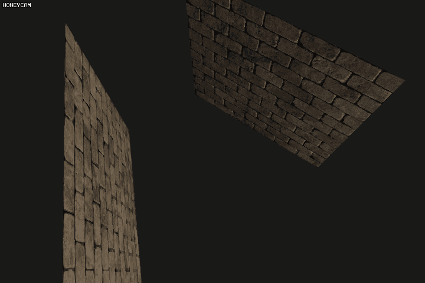

# Chapter 28. Normal Mapping

실시간 렌더링에서 물체의 질감 등을 매우 좋게 **보이게 하기** 위해 사용할 수 있는 것 중 하나가 **Normal Map** 을 이용하는 것이다. 사실 요즘 게임들을 보면 이 기법을 사용하지 않는 3D 게임은 없다고 해도 과언이 아니다. 

이 기법은 일반 평평한 표면 등에 노멀 값을 조작해서 조명 등을 비출 때 이 노멀 값에 따라 조명 효과가 나게끔 할 수 있다. 그래서 아주 디테일하게 조명효과가 들어간 것들이 사실은 몇 백 폴리곤도 안되는 로우 폴리곤의 덩어리였다던가 할 수 있다.

간단한 예로 벽돌 벽을 들 수 있다. 벽돌 벽은 중간 중간이 울퉁불퉁하고 틈새가 있거나 약간 깨진 부분 등이 있을 수 있다. 이 곳에 조명 효과가 들어가면 깨진 부분은 조명 이펙트를 더 많이 받을 수 있다. 틈새의 경우에는 그림자가 질 확률이 높다. 하지만 이 구현 사항들을 오로지 폴리곤으로만 해결하려고 한다면 요구 사양은 하늘을 치솟을 것이다.

하지만 **노멀 맵** 이 대신 등장해서 조명 효과에 필요한 값을 대신한다면 어떨까? 일단 디퓨즈 맵에 노멀 맵을 씌우면, 연산시에 인식되는 표면은 다음과 같을 것이다.


노멀 맵의 값에 의해서 조명이 달라지기 때문에, 오른쪽과 같이 노멀이 인식되서 좀 더 디테일한 효과를 폴리곤 증가 없이 수행할 수 있게 된다.


이렇게, 폴리곤을 무지막지하게 증가시켜서 디테일을 늘리는 기법을 쓰지 않고 프래그먼트 당(**per-fragment**) 노멀 맵의 텍셀을 따와 효과를 처리하는 기법을 **Normal Mapping** 이라고 한다.


대개 노멀 맵핑에 쓰이는 노멀 맵은 위와 같이 이상한 색 계조인 것 이 많은데, 벽은 서있을 때 빛의 영향을 제대로 받기 때문이다. 거의 모든 텍셀의 벡터가 $$ (0, 0, 1) $$ 에 가까운 색이어야 빛에 의해 사실적인 조명 효과를 기대할 수 있다. 일단 이 노멀 맵핑으로 조명 효과를 한번 구현해본다.

``` c++
vec3 CalculatePointLight(sPointLight light) {
	vec3 color		= vec3(texture(textureDiffuse1, fTexCoord));
	vec3 normal		= texture(textureNormal, fTexCoord).rgb;
	normal			= normalize(normal * 2.0 - 1.0);
  	// ...
}
```

벽을 `z` 축으로 이동해서 설치하고, 다시 90도 회전해서 `x` 축에 대해 이동한 상태의 벽을 하나 더 설치한다. 그리고 빛을 설치해 조명이 어떻게 구현되는 가를 확인해본다.


조명 효과가 보다 디테일해진 것을 알 수 있다...만 오른쪽 벽의 경우에는 빛의 위치에 비해서 효과 적용이 이상한 것을 알 수 있다. 왜냐면 노멀 맵의 텍셀의 값은 `z` 축에 대한 노멀 값을 가지고 있기 때문이다. 따라서 실제 표면의 벡터는 `x` 축을 향하고 있는데, 노멀 값은 여전히 `z` 축을 가리키고 있으므로 조명이 이상하게 적용되는 것이다.


이를 해결할려면 모델이 회전 가능한 방향마다 각각의 노멀맵을 불러와 쓰게 하는 방법, 또는 *회전만을 가진 model matrix* 을 적용해서 일일히 회전시키는 방법 등이 있다. 하지만 이 방법은 연산량이 크거나 리소스 양이 기하급수적으로 많아질 확률이 높다. 그래서 마지막 방법으로, **빛의 방향 벡터** 를 **Tangent space**의 좌표로 변형시켜서 조명 효과를 적용하는 방법을 택한다. 이 방법을 이용하면 연산량도 그렇게 많아지지도 않을 뿐더러 같은 노멀 맵을 쓸 수 있다.

## Tangent space

*노멀 맵* 의 값들이 거의 `z` 축을 가리키고 있을 때, 맵의 실제 노멀 벡터는 **Tangent space** 로 표현될 수 있다. (?? 내가 써놓고도 무슨 말인지...) 탄젠트 공간은 어느 한 프리미티브 공간에 대해 각자 독립적인 공간을 갖는다. Normal, Tangent, Bitangent 는 좌표 공간의 basis 또는 축을 가진다. 노멀 맵의 법선 벡터 값들은 특정 매트릭스를 곱해서 각자의 Tangent space 에서 World space 에서의 적절한 법선 값을 가질 수 있다.

이 특정 매트릭스란 **TBN** 이라고도 말한다. 단순히 첫 행에 탄젠트 백터가, 그리고 바이탄젠트 마지막으로 노멀 벡터가 들어가기 때문이다. 이 매트릭스에 Model matrix 을 곱한 최종 TBN 매트릭스는 노멀 맵의 값들 (방향 좌표) 를 World space 로 옮기는데 사용된다.


위 Quad 에서는 구해진 탄젠트 ($$ \mathbf{t} $$) 와 바이탄젠트 ($\mathbf{b}$) 가 $x$ 축과 $ y $ 축과 같은 것 처럼 보인다. 하지만 실제 하는 두 벡터 값들은 표준 노멀 값, 프리미티브의 크기, 텍스쳐의 위치 차이 등에 따라서 다양한 축들을 가질 수도 있다.

그러면 $\mathbf{t}$ 와 $\mathbf{b}$ 을 구하는 방법은 다음과 같다. 


우선 $\mathbf{p_1}$, $\mathbf{p_2}$, $\mathbf{p_3}$ 이 한 프리미티브를 구성하는 3 개의 벡터라고 했을 때, $ \mathbf{e}_1$은 한 정점에서 다른 정점 사이의 거리 및 방향 벡터이고 $ \mathbf{e}_ 2 $는 다른 정점과의 거리 및 벡터이다. 각 정점마다 텍스쳐 맵의 텍셀 위치가 좌표로 주어져 있는데, 이를 **UV coordinate** 라고 한다. 이제 벡터 e 을 구해줬듯이, 같은 방식으로 $$ \Delta\mathbf{u}_{1,2} $$ 혹은 $$ \Delta\mathbf{v}_{1,2} $$ 을 구해야 한다.  그러면 $$ \mathbf{t} $$ 와 $$ \mathbf{b} $$ 을 구할 준비는 끝났다.
$$
\begin{bmatrix}E_1 \\ E_2 \end{bmatrix} = \begin{bmatrix}\Delta\mathbf{U V}_1 \\ \Delta\mathbf{U V}_2 \end{bmatrix}\begin{bmatrix}T_{(x, y, z)} \\ B_{(x, y, z)}\end{bmatrix}
$$
여기서 T(tangent) 와 B(bitangent) 을 구해야 하는데, $ \Delta\mathbf{U V} $ 의 Matrix 가 선형으로 독립적임을 가정하고 Invert 한다. 그러면 다음과 같이 T 와 B 의 벡터를 매트릭스로 구할 수 있다.
$$
\begin{bmatrix}\Delta\mathbf{U V}_1 \\ \Delta\mathbf{U V}_2 \end{bmatrix}^{-1}\begin{bmatrix}E_1 \\ E_2 \end{bmatrix} = \begin{bmatrix}T_{(x, y, z)} \\ B_{(x, y, z)}\end{bmatrix}
$$
코드 상의 구현은 다음과 같다. (사실 `glm` 의 기본 기능을 이용해서 일일히 계산해줄 필요 없이 쉽게 구현할 수 있다.)

``` c++
// positions
glm::vec3 pos1(-1.0f, 1.0f, 0.0f);
glm::vec3 pos2(-1.0f, -1.0f, 0.0f);
glm::vec3 pos3(1.0f, -1.0f, 0.0f);
glm::vec3 pos4(1.0f, 1.0f, 0.0f);
// texture coordinates
glm::vec2 uv1(0.0f, 1.0f);
glm::vec2 uv2(0.0f, 0.0f);
glm::vec2 uv3(1.0f, 0.0f);
glm::vec2 uv4(1.0f, 1.0f);
// normal vector
glm::vec3 nm(0.0f, 0.0f, 1.0f);

// triangle 1
// ----------
glm::vec3 edge1 = pos2 - pos1;
glm::vec3 edge2 = pos3 - pos1;
glm::vec2 deltaUV1 = uv2 - uv1;
glm::vec2 deltaUV2 = uv3 - uv1;

GLfloat f = 1.0f / (deltaUV1.x * deltaUV2.y - deltaUV2.x * deltaUV1.y);

// calculate tangent/bitangent vectors of both triangles
glm::vec3 tangent1{
    f * (deltaUV2.y * edge1.x - deltaUV1.y * edge2.x),
    f * (deltaUV2.y * edge1.y - deltaUV1.y * edge2.y),
    f * (deltaUV2.y * edge1.z - deltaUV1.y * edge2.z) };

glm::vec3 bitangent1{
    f * (-deltaUV2.x * edge1.x + deltaUV1.x * edge2.x),
    f * (-deltaUV2.x * edge1.y + deltaUV1.x * edge2.y),
    f * (-deltaUV2.x * edge1.z + deltaUV1.x * edge2.z) };

// triangle 2
// ----------
glm::vec3 edge12 = pos3 - pos1;
glm::vec3 edge22 = pos4 - pos1;
glm::vec2 deltaUV12 = uv3 - uv1;
glm::vec2 deltaUV22 = uv4 - uv1;
// ...
```

헷갈린다. 아무래도 다른 책을 찾아서 한번 더 보던가 해야할 것 같다... 근데 이렇게 모든 정점의 표면 정점 벡터가 동일하지 않고, 프리미티브가 서로 연결됬을 때 연결된 정점이 각기 다른 벡터를 가질 경우가 있다. 그 때는 해당 정점의 벡터 속성들을 평균지어 TBN 을 만들거나 한다고 한다.

그리고 **VIEW * TBN** 을, Normal map 에서 추출되는 *평준화된* 노멀 값에 적용해서 선형 변환을 시키면, World space 상에서의 노멀 값이 나온다. 이것을 쓰면 된다.

``` c++
vec3 T = normalize(vec3(model * vec4(aTangent, 0)));
vec3 B = normalize(vec3(model * vec4(aBitangent, 0)));
vec3 N = normalize(vec3(model * vec4(aNormal, 0)));
```

``` c++
vec3 normal		= texture(textureNormal, fTexCoord).rgb;
normal			= normalize(normal * 2.0 - 1.0);
normal			= normalize(fTBN * normal);
```

> 만약 Bitangent 가 값이 없으면, T 와 N 의 외적을 이용해서 ($$ \mathbf{t} \times \mathbf{n} $$) 구하면 된다. GLSL 에서는 `cross(T, N)` 을 쓴다.

그러면 다음과 같이 제대로 적용된 것을 볼 수 있다.



## 복잡한 모델에서의 적용

노멀 맵을 이용해서 복잡한 모델에서도 위 방법을 이용해 적용할 수 있다. (대개 모델이 Tangent 을 가지고 있지 않다고 하더라도 Assimp 을 통해서 만들어 줄 수 있다.)


위에서, 여러가지 다른 각도의 프리미티브가 존재하고 겹치는 정점의 벡터 성분을 평균을 낸 후에 TBN 적용을 한다고 했었다. 이 방법은 조명 효과 등을 부드럽게 넘기는데는 좋지만 결점이 하나 존재한다. Tangent, Normal, Bitangent 가 평균화 되었을 때 이 셋 벡터가 선형 비독립일 수도 (서로 직교하지 않을 수도) 있다는 점이다.

이를 보정하고 싶다면 다음과 같이 $$ T $$ 와 $$ N $$ 을 그람-슈미트 투영 (Gram-Schmidt process) 와, 외적을 통해 다시 직교화시킬 수 있다.

``` c++
vec3 T = normalize(vec3(model * vec4(aTangent, 0.0)));
vec3 N = normalize(vec3(model * vec4(aNormal, 0.0)));
// re-orthogonalize T with respect to N
T = normalize(T - dot(T, N) * N);
// then retrieve perpendicular vector B with the cross product of T and N
vec3 B = cross(N, T);

mat3 TBN = mat3(T, B, N) 
```

