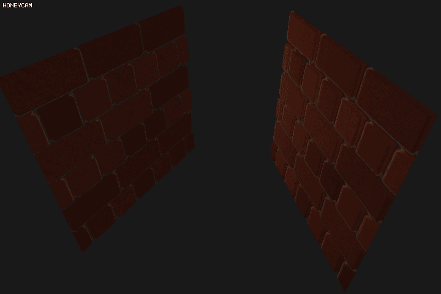

# Chapter 29. Parallax Mapping

패럴렉스 맵핑은 노멀 맵핑과 거의 비슷하지만 다른 맵핑 기법이다. 노멀 맵핑의 경우에는 표면 자체의 노멀을 조작해서 디테일감을 주는 반면에, Parallax Mapping 은 아예 구현되는 깊이를 변형시켜서 텍스쳐의 깊이감을 극대화시키는 효과를 가진다. 

이 맵핑 기법은, **기하 도형을 수정하는 Displacement Mapping** 에 속하지만, 이 맵핑 기법의 특유의 성능 저하를 막기 위해 실제 기하 정보는 바꾸지 않고 픽셀 색깔 정보만 변경해서 보여준다. 즉, (Displacement Mapping + Bump mapping = Parallax Mapping)

> **Bump mapping** [link](https://en.wikipedia.org/wiki/Bump_mapping)
>
> 물체 표면의 울퉁불퉁함 혹은 혹, 그외 들어간 부분들을 표현하기 위해 사용하는 기법이다. Normal Mapping 과 비슷해서 표면 노멀을 교란시키고 Bump map 과 TBN 을 이용해 조명 효과를 이용한다.

여튼 이 기법을 구현하기 위해서는 **Height Map** 이 필요하다. 


이 맵을 완전 평면인 표면에 가져다 대서, 조명 효과에 쓰면 다음과 같이 금방이라도 튀어나올 것 같은 효과를 얻을 수 있다. (고 한다)


사실 패럴렉스 맵핑 이전에는 Geometry shader 까지 동원해서, 아예 프리미티브 위치를 변경해버리는 Displacement Mapping 이 있었다. 이 기법은 실시간 렌더링에 적극적으로 사용하기에는 성능 상 매우 버거운 단점이 있다. 그러나 Parallax Mapping 은 Height map 을 적극적으로 활용해서 프리미티브 위치를 바꾸지 않고도 위와 같은 입체적인 이미지 (가장자리는 discard 된 것 같음) 을 얻을 수 있다.

패럴렉스 맵핑은 그 기반에, 카메라의 보는 방향과 Height map 을 이용해서 텍스쳐의 좌표를 바꾸는 기법이 적용된다. 좀 더 자세히 살펴보면 다음과 같다.


*빨간색* 선은 Height Map 을 나타내며 $$ \overline{V} $$ 는 프래그먼트 위치에서 카메라 시점까지의, 보는 방향을 나타낸다. 그리고 만약 패럴렉스 맵핑이 적용된다면, 유저 입장에서는 $$ B $$ 의 텍스쳐가 보일 것이다. 하지만 실제 기하학 쉐이더를 이용해서 Height map 에 따라 프리미티브가 재구성되지는 않았기 때문에 실제 표면에 닿는 점은 $$ A $$ 일 것이다. 패럴렉스 맵핑은, **$$ B $$ 에 해당하는 텍스쳐를 볼 수 있도록 A 점에서 효율적인 방식으로 offset 을 줘서 그렇게 보이게 하도록** 한다. 

일단 골자는 다음과 같다.

1. 현재 실제 프래그먼트 위치에 해당되는 Height map 의 Height 값을 받는다.
2. 프래그먼트와 카메라 위치까지의 방향 벡터를 Height 값만큼 스케일링 한다.
3. Height 값 만큼 스케일링하여 프래그먼트에 투영된 위치의 Texel 을 가져온다.

하지만 이 방법은 효율적이지만 약간의 문제를 포함한다. 만약 Height 의 기울기가 매우 가파르다면 (Steep) 부적절한 Texel 이 선택될 수도 있기 때문이다.


그리고 텍셀의 위치를 가져올 때 표면이 기울어져 있으면 적절한 텍셀을 가져올 수 없다는 것이 문제다. 하지만 이 문제는 이전 노멀 맵핑에서처럼 **Tangent Space** 을 이용해 해결할 수 있고 한다.

## Parallax Mapping

튜토리얼 사이트에서 받은 Height map 은 명암이 반대로 되어있는 것을 알 수 있다. 따라서 튜토리얼 사이트에서는 다음같이 약간 이상한(?) 이미지로 설명을 할려고 하고 있다.


이미지의 Height 값이 반대로 되든, 아니던간에 적용하는 기법이나 결론은 동일하다. $$ A $$ 라는 표면을 볼 때, $$ B $$ 에 나타날 텍스쳐는 $$ H(P) $$ 의 위치에 값을 가지는 컬러 값 (텍셀) 이다. 이제 이동된 텍스쳐 픽셀을 어떻게 구하는가? 를 보면 다음과 같은 단계를 가진다.

1. 카메라와 프래그먼트 사이의 평준화된 방향 벡터를 구한다.
2. 텍스쳐의 오프셋을 구해야 하기 때문에, `z` 축에 수직이 되도록 역회전을 시킨다.
   그 후에 기존 위치의 Height 값을 받아와 `xy` 값에 곱한다. 평준화를 다시 하면 Offset 이 된다.
3. 기존 텍셀 위치에 빼거나 더해서 새로운 텍셀 위치를 받는다. (빼게 되면 텍스쳐가 약간 위로 쏠린 듯한 느낌을 받고, 더하게 되면 밑으로 쏠리는 느낌을 받는다)
4. 기존과 같이 렌더링한다.

Fragment Shader 의 코드는 다음과 같다.

``` c++
float height	= height += texture(textureHeight, fTexCoord).r;
vec3 cameraDir	= normalize(cameraPos - fFragPos);
vec2 height_offset = vec2(fModel * vec4(cameraDir.xyz, 0)) * (1 - height) * 0.3;
vec2 texCoord	= fTexCoord - height_offset;

vec3 lightVec	= light.position - fFragPos;
vec3 color		= vec3(texture(textureDiffuse1, texCoord));
vec3 normal		= texture(textureNormal, texCoord).rgb;
normal			= normalize(normal * 2.0 - 1.0);
normal			= normalize(fTBN * normal);
```

결과는 다음과 같다. 회전된 객체도 정상적으로 Parallax Mapping 이 된 것을 확인할 수 있다.



하지만 이 방식은 카메라가 표면과 거의 나란히 서 있게 되면 텍스쳐의 왜곡이 생기는 것을 알 수 있다. 따라서 보정을 해서 최대한 왜곡을 줄여보기로 했다. 보정은 MSAA 의 아이디어를 빌린다. 해당 기준 텍셀의 좌우상하 4개의 추가점을 샘플링한 후, 평균을 낸 값을 맵핑에 이용하는 방식을 써보았다.

``` c++
float height	= 0.f;
float P = 0.01f;

vec2 xy[4] = { vec2(-P, -P), vec2(P, P), vec2(-P, P), vec2(P, -P) };
for (int i = 0; i < 4; ++i) {
	height += texture(textureHeight, fTexCoord + xy[i]).r / 4;
}
```

그러면 다음처럼 거의 표면과 나란한 각도에 있어도 그렇게 왜곡이 되지 않는 것을 알 수 있다.


그래도 기왕이니 좀 제대로 된 방법을 써서 왜곡을 없애보도록 한다. 왜곡을 없애는 맵핑 기법은 **Steep Parallax Mapping** 이라고 알려져 있다.

## Steep Parallax Mapping

*깊은 시차 맵핑* 은 단순히 길이를 구해서 텍셀 위치를 이동시키지 않고, **여러 번 샘플링**해서 가장 적절한 깊이 값을 뽑아내는 방법이다.

즉 다음 그림과 같다.


이 그림을 기준으로 설명을 하면, 프래그먼트 위치에 해당되는 텍셀에서 시작해, 정해진 샘플링 수 동안 이동해야할 **텍셀 방향으로 조금씩 이동**하면서 (많이 이동하면 결과가 왜곡된다) Height 값을 비교하는 방식이다. 이 때 이동하면서 비교될 **반복 별 깊이 값**이 정해지고, 반복을 계속할 수록 일정 수치 (대개 $ 1.0 \div Layers$) 씩 올라가게 된다.

`for` 이나 `while` 등으로 반복을 계속 하다가, 현재 기준 깊이값보다 텍셀에서 뽑아온 깊이값이 작으면 (Height Map 이 역이 아닌 상황에서는 크면) 해당 값을 결과 값으로 택한다.

``` c++
while (current_depth > layer_depth) {
	current_depth = texture(textureHeight, tex_pos).r;

	tex_pos -= offset;
	layer_depth += layer_depth_offset;
}
```

다만 tex_pos 을 모든 텍스쳐에 넘길 텍셀로 쓰지 않고, 대신에 layer_depth 값을 이용해서 기존 텍셀 위치를 이동시키는 방법을 쓴다. 그래야 사용자에게 벽돌이 튀어나오는 착시를 불러 일으킨다.


다만 이 *깊은 시차 맵핑* 은 샘플 수가 유한하기 때문에 표면에 나란히, 가까이 갈 수록 레이어가 갈라지는 현상이 생긴다고 한다. (음...)


이렇게 되면 샘플을 무작정 늘리자라고 생각할 수 도 있지만, 그러면 성능이 대폭 떨어질 수 밖에 없다. 어떻게 해야할까? **Parallax Occlusion Mapping** 을 써서, 깊이의 선형 보간을 하면 보다 정확한 값을 얻을 수 있다고 한다. (성능이 약간 더 필요해지는 건 어쩔 수 없다)

## Parallax Occlusion Mapping

*시차 폐색 맵핑* 은 *깊은 시차 맵핑* 과 같지만, 끝에서 부수 처리를 하는 점이 다르다. 깊이 값을 구할 때, 전 레이어에서 비교한 텍셀의 깊이 값과 평균을 지어서 선형 보간을 한다.


여기서 선형 보간은, 끝점이 주어졌을 때 위치한 값을 추적하기 위해서 선형적으로 계산하는 방법이다.


$$
f(p) = \frac{d_2}{d_1 + d_2}f(p_1) + \frac{d_1}{d_1 + d_2}f(p_2)
$$
코드는 다음과 같다.

``` c++
// POM
float A = layer_depth - current_depth;
float B = texture(textureHeight, tex_pos - offset).r - (layer_depth - layer_depth_offset);
float W = A / (A + B);

vec2 finalTexCoord = W * (tex_pos - offset) + (1.0 - W) * tex_pos;
```

근데 이렇게 하면 어째서인가 깊이감이 다 사라져 버리는데, 어떻게 안되는 걸까... 구현을 잘못 한 것 같다. 아니면 뭔가 다른 방법이 있는걸까? (계속...) 밑의 짤은 튜토리얼 사이트에서 가져온 짤. 아마 이렇게 되야하는 것 같다.


